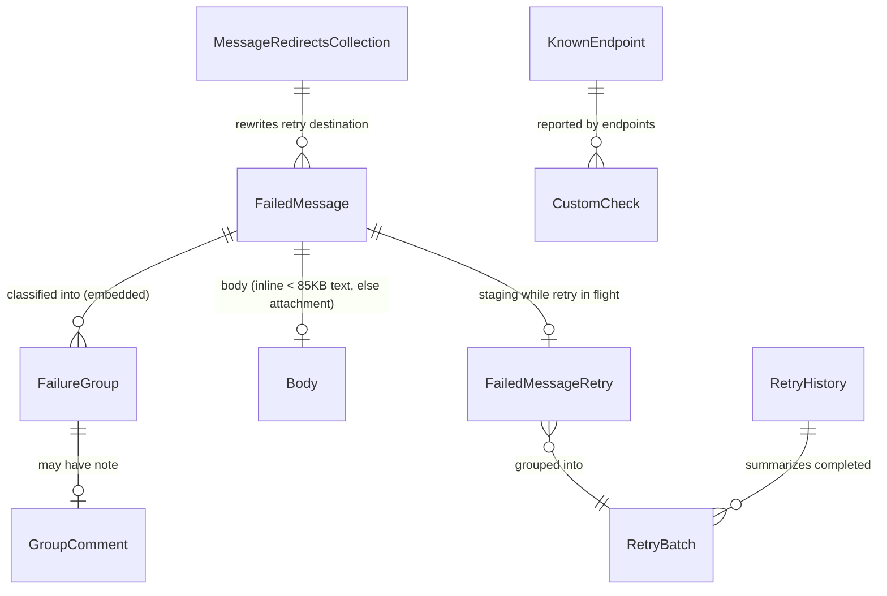

# ServiceControl 4.x primary-instance collections

What each RavenDB 3.5 collection in a ServiceControl 4.x **error/primary** instance stores,
how the documents relate, and whether `sc-migrate` carries them to 5.x.

## How the documents relate

## Migrated collections

| Collection | Backs | Tier | Why |
|---|---|---|---|
| `FailedMessages` (+ bodies) | The failed-message list, groups, archive in ServicePulse | **Critical** | The only non-regenerable data; the reason this tool exists. Unresolved carries over as-is; RetryIssued becomes Unresolved (see below). Resolved/Archived/RetryIssued past retention are dropped (matching the 4.x cleaner). |
| `GroupComments` | Notes operators attach to failure groups | **Important** | Human-entered; silently lost otherwise. |
| `RetryOperations/History` | Recoverability → History screen | **Important** | Historical record of past group retries; not reconstructable. |
| `messageredirects` | Retry redirects (route retries to a different queue) | **Important** | Configuration that *silently changes retry behavior* if lost — a retry after migration would go to the original, possibly decommissioned, queue. |
| `NotificationsSettings/All` | Email notification config | **Important** | Small, human-entered, easy to forget to re-enter. |
| `CustomChecks` | Custom Checks screen | Nice-to-have | Self-healing: endpoints re-report on their check interval. Migrating avoids a blank dashboard until they do — and keeps *failed* checks visible from minute one. |
| `KnownEndpoints` | Endpoint list + monitored flags | Nice-to-have | Self-healing via heartbeats/ingestion, but the `Monitored` toggle is operator-set state that would reset. |

### FailedMessage status handling

| 4.x status | After import | Expiry |
|---|---|---|
| 1 Unresolved | 1 Unresolved | never (`@expires` absent) |
| 2 Resolved | 2 Resolved | `LastModified + ErrorRetentionPeriod` |
| 3 RetryIssued | **1 Unresolved**¹ | never |
| 4 Archived | 4 Archived | `LastModified + ErrorRetentionPeriod` |

¹ Evaluated against the *original* status, before normalization: a RetryIssued document whose
`LastModified + ErrorRetentionPeriod` is already in the past at import time is dropped entirely
(same as Resolved/Archived), not imported as an eternal Unresolved. Import's `--error-retention`
retention check always runs against the pre-normalization status.

RetryIssued means "a retry was dispatched and no outcome has arrived yet." The retry staging
documents don't migrate, so the outcome can never arrive on the new instance — the message
would hang in that state forever. As Unresolved, the operator simply retries it again.
Quiesce retries before the migration window to keep this set near zero.

## Skipped collections

| Collection | What it is | Why skipped |
|---|---|---|
| `EventLogItems` | ServicePulse event feed | Regenerated noise; default retention only 14 days. |
| `RetryBatches`, `RetryBatches/NowForwarding`, `FailedMessageRetries` | In-flight retry staging | Transient coordination state between SC and its own queues; meaningless on a new instance. Cause of the RetryIssued normalization above. |
| `FailedMessageEdit` | Edit-and-retry staging | Transient. |
| `ArchiveOperations/*`, `UnarchiveOperations/*` | Progress bars for bulk (un)archive | Transient progress state. |
| `FailedErrorImports`, `FailedAuditImports` | Poison messages that failed ingestion | Tied to the old instance's queues; re-ingest on 4.x before migrating if they matter. |
| `ProcessedMessages` | Pre-4.x-split embedded **audit** data | Audit is out of scope — the documented side-by-side/remotes path covers it. |
| `SagaSnapshots` | Saga audit plugin data | Same: audit-instance concern in 5.x. |
| `Subscriptions` / `Subscriptions/All` | SC's internal NServiceBus subscription storage | Infrastructure; the 5.x instance rebuilds its own. |
| `ReclassifyErrorSettings` | One-shot 4.x reclassification flag | Meaningless in 5.x. |
