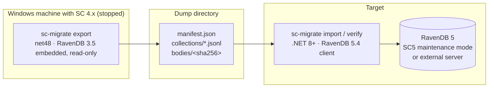

# ServiceControl.Migrate4to5

Data migration utility for [ServiceControl](https://github.com/Particular/ServiceControl) **error/primary** instances: export the operational core of a stopped 4.x instance's embedded RavenDB 3.5 database and import it into the RavenDB 5 database of a 5.x instance.

The official [4 → 5 upgrade procedure](https://docs.particular.net/servicecontrol/upgrades/4to5/) includes no data migration for the error instance — customers are told to drain (retry/archive) all failed messages and then run a destructive forced upgrade. This tool preserves that data instead: unresolved and archived failed messages (including bodies), group comments, retry history, message redirects, notification settings, custom checks, and known endpoints.

> ⚠️ Early stage — design phase. See the [design spec](docs/superpowers/specs/2026-07-03-sc4to5-data-migration-design.md).

## How it works

Also works against the `_UpgradeBackup` directory the official forced upgrade leaves behind — making the destructive upgrade path recoverable after the fact.

## Status

- [x] Design spec
- [ ] Implementation plan
- [ ] Exporter (net48, RavenDB 3.5)
- [ ] Importer / verifier (.NET 8+, RavenDB 5.4)
- [ ] `COLLECTIONS.md` data dictionary
- [ ] Operator runbook
