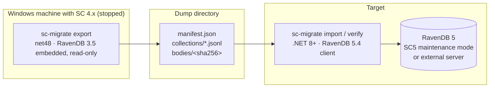

# ServiceControl.Migrate4to5

Data migration utility for [ServiceControl](https://github.com/Particular/ServiceControl) **error/primary** instances: export the operational core of a stopped 4.x instance's embedded RavenDB 3.5 database and import it into the RavenDB 5 database of a 5.x instance.

The official [4 → 5 upgrade procedure](https://docs.particular.net/servicecontrol/upgrades/4to5/) includes no data migration for the error instance — customers are told to drain (retry/archive) all failed messages and then run a destructive forced upgrade. This tool preserves that data instead: unresolved and archived failed messages (including bodies), group comments, retry history, message redirects, notification settings, custom checks, and known endpoints.

## How it works



Also works against the `_UpgradeBackup` directory the official forced upgrade leaves behind — making the destructive upgrade path recoverable after the fact.

See [`COLLECTIONS.md`](COLLECTIONS.md) for the full data dictionary — what each 4.x collection backs, how documents relate, and why each is migrated or skipped — and the [design spec](docs/superpowers/specs/2026-07-03-sc4to5-data-migration-design.md) for the full rationale behind the architecture, transforms, and constraints.

## Usage

Three verbs across two executables:

### `sc-migrate-export export`

Runs on the Windows machine that hosts (or hosted) the SC4 instance. `net48`, because it links `RavenDB.Database 3.5.10-patch-35319` to open the Esent-backed embedded store read-only. Streams every migrated collection to a dump directory, resolving each `FailedMessages` processing attempt's body (inline, `MessageMetadata`, or legacy attachment) into content-addressed files under `bodies/`. Writes `manifest.json` **last**, so a dump left behind by a crashed or killed export is detectable as incomplete rather than silently short.

```bash
sc-migrate-export export --db-path "C:\ProgramData\Particular\ServiceControl\Particular.ServiceControl" --out D:\dumps\sc4-dump
```

Options:

| Option | Required | Meaning |
|---|---|---|
| `--db-path` | yes | Path to the 4.x RavenDB 3.5 database directory (or an `_UpgradeBackup` copy — see below) |
| `--out` | yes | Dump directory to create |
| `--error-retention` | no | `TimeSpan` (e.g. `15.00:00:00` for 15 days); Resolved/Archived messages already past this age at export time are skipped, matching what 4.x's own retention cleaner would have removed |
| `--collections` | no | Comma-separated subset of collection names to export (default: all migrated collections) |

### `sc-migrate import`

Runs anywhere with network access to the target RavenDB 5 server. `.NET 8+`, using the `RavenDB.Client 5.4.x`. Applies every transform (metadata rewrite, body re-attachment, `@expires` stamping, `RetryIssued → Unresolved` normalization) and bulk-inserts in batches. **Idempotent and resumable** — documents already present in the target are skipped, never overwritten, so after any crash or network drop you just rerun the same command; it only adds what's still missing.

```bash
sc-migrate import --in D:\dumps\sc4-dump --url http://localhost:33334 --database primary --error-retention 15.00:00:00
```

Options:

| Option | Required | Meaning |
|---|---|---|
| `--in` | yes | Dump directory produced by `export` |
| `--url` | yes | RavenDB 5 server URL (SC5 maintenance-mode embedded server, default port `33334`, or an external server) |
| `--database` | no | Target database name (default `primary`) |
| `--error-retention` | yes | Same `TimeSpan` as export; stamps `@expires` on Resolved/Archived messages as `LastModified + retention` |
| `--cert` / `--cert-password` | no | Client certificate for a secured RavenDB server |
| `--batch-size` | no | Documents per bulk-insert batch (default `128`) |

### `sc-migrate verify`

Compares the dump against the target after import: per-collection counts, field-by-field diff of random sampled documents (after re-applying the same transform), and attachment presence/size for sampled bodies. **Its exit code is the cutover gate** — `0` means safe to proceed, `1` means stop and investigate before starting SC5 normally.

```bash
sc-migrate verify --in D:\dumps\sc4-dump --url http://localhost:33334 --database primary --error-retention 15.00:00:00
```

Options:

| Option | Required | Meaning |
|---|---|---|
| `--in` / `--url` / `--database` / `--error-retention` | yes | Same as `import` |
| `--samples` | no | Number of documents (and bodies) to spot-check per collection (default `100`) |
| `--seed` | no | Random seed for sample selection, for reproducible runs (default fixed) |
| `--cert` / `--cert-password` | no | Same as `import` |

## Operator runbook

1. **Stop the SC4 error instance.** Quiesce retries beforehand — in-flight retry staging does not cross the migration, and a `RetryIssued` message whose confirmation never arrives becomes `Unresolved` on the new instance (see [`COLLECTIONS.md`](COLLECTIONS.md#failedmessage-status-handling)).

2. **Export.** Run `sc-migrate-export export` against the stopped instance's `DbPath`:

   ```bash
   sc-migrate-export export --db-path "C:\ProgramData\Particular\ServiceControl\Particular.ServiceControl" --out D:\dumps\sc4-dump --error-retention 15.00:00:00
   ```

   If the official destructive Force Upgrade has already run, export from the `_UpgradeBackup` copy instead — see below.

3. **Force-upgrade or install SC5.** Follow the [official 4 → 5 upgrade procedure](https://docs.particular.net/servicecontrol/upgrades/4to5/), or install SC5 fresh alongside.

4. **Start SC5 in maintenance mode** (RavenDB only, no NServiceBus endpoint) so the importer has a server to connect to without SC5 also ingesting live traffic yet:

   ```bash
   ServiceControl.exe --maintenance
   ```

5. **Import, then verify.** Verify's exit code gates the next step:

   ```bash
   sc-migrate import --in D:\dumps\sc4-dump --url http://localhost:33334 --database primary --error-retention 15.00:00:00
   sc-migrate verify --in D:\dumps\sc4-dump --url http://localhost:33334 --database primary --error-retention 15.00:00:00
   ```

   If `import` reports errors or `verify` exits `1`, do not proceed — investigate, and rerun `import` (it's safe to repeat) followed by `verify`.

6. **Start SC5 normally.** Stop the maintenance-mode process and start the SC5 service/endpoint as usual. Point ServicePulse at it and confirm the migrated data (see [`docs/e2e-acceptance.md`](docs/e2e-acceptance.md) for a full checklist).

## Disk space

The dump is roughly the size of the exported data from the source database — attachments (message bodies) dominate, since `FailedMessages` metadata is small per document. Content-addressed body storage (`bodies/<sha256>`) deduplicates identical bodies across processing attempts and across messages (e.g. many failures of the same message, or many instances of the same recurring error), so the dump is often smaller than a naive per-attempt export would suggest.

The official [ServiceControl 4 to 5 upgrade guide](https://docs.particular.net/servicecontrol/upgrades/4to5/) recommends estimating roughly **20% more disk space** than the existing RavenDB 3.5 database for the migration window.

## `_UpgradeBackup` recovery

The official destructive Force Upgrade procedure renames the old RavenDB 3.5 database directory with a `_UpgradeBackup` suffix before creating a fresh RavenDB 5 database — the old data isn't deleted immediately, just set aside. If that destructive upgrade has already happened and no dump was taken beforehand, `sc-migrate-export export --db-path` can point directly at the `_UpgradeBackup` directory: it's still a valid, complete RavenDB 3.5 database on disk, just no longer the active one. This makes the destructive official path recoverable after the fact, as long as the `_UpgradeBackup` directory hasn't been cleaned up.

## Project status

Design complete; `export`, `import`, and `verify` are implemented. The exporter's test suite (`net48`, Esent) only runs on Windows; the importer's and dump-format tests run cross-platform.
