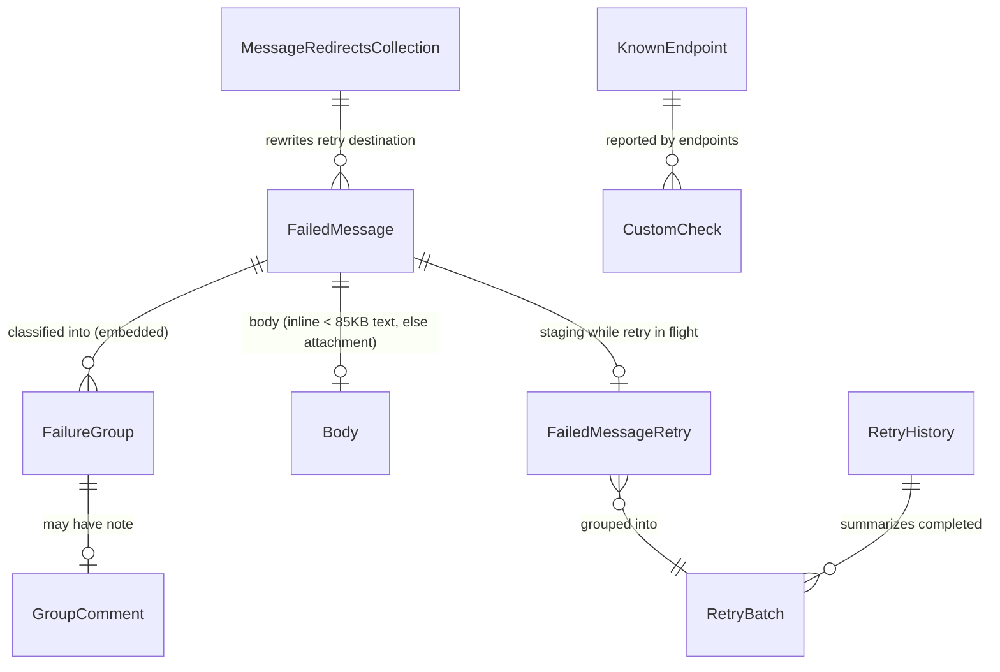

# ServiceControl.Migrate4to5 Implementation Plan

> **For agentic workers:** REQUIRED SUB-SKILL: Use superpowers:subagent-driven-development (recommended) or superpowers:executing-plans to implement this plan task-by-task. Steps use checkbox (`- [ ]`) syntax for tracking.

**Goal:** A two-executable CLI that exports the operational core of a stopped ServiceControl 4.x error instance's embedded RavenDB 3.5 database to a versioned dump directory, and imports it into the RavenDB 5 database of a ServiceControl 5.x error instance.

**Architecture:** Three projects — `DumpFormat` (netstandard2.0, shared contracts), `Exporter` (net48, hosts RavenDB 3.5 embedded read path), `Importer` (net8.0, RavenDB 5.4 client, owns all transforms plus `verify`). All transforms happen at import; the dump is a faithful snapshot of the source.

**Tech Stack:** C#, RavenDB.Database 3.5.10-patch-35319 (Particular feedz.io), RavenDB.Client + RavenDB.Embedded 5.4.209, Newtonsoft.Json 13.0.3, NUnit 4.

**Spec:** `docs/superpowers/specs/2026-07-03-sc4to5-data-migration-design.md` — read it before starting any task.

## Global Constraints

- Central Package Management (`Directory.Packages.props`); versions pinned exactly as listed in Task 1.
- `Exporter` + `Exporter.Tests` target `net48` and only ever *run* on Windows (Esent). They must still *build* on Linux (via `Microsoft.NETFramework.ReferenceAssemblies`). All other projects target `net8.0` (`DumpFormat`: `netstandard2.0`) and run anywhere.
- `Importer` never deletes or overwrites documents in the target; `Exporter` never writes to the source database.
- Namespace root: `ServiceControl.Migrate4to5.<Project>`; file-scoped namespaces everywhere.
- No AI attribution in commits. Commit messages start with a gitmoji (✨ feature, ✅ tests, 📝 docs, 👷 CI, 🔧 config).
- `TreatWarningsAsErrors=true`, `Nullable=enable` (exception: `Exporter` may use `#nullable disable` per-file where Raven 3.5 APIs make annotations impractical).
- Dump format version constant: `1`. Any format change after first release requires bumping it.
- Body size threshold constant `85_000` (Large Object Heap limit) — single definition in `DumpFormat`, never re-declared.

## Reference material (read-only worktrees)

- 4.x source of truth: `~/src/ServiceControl@4.33.5` — body placement: `src/ServiceControl/Operations/BodyStorage/BodyStorageEnricher.cs` (embedded `attempt.Body` or `MessageMetadata["Body"]` when < 85000 bytes non-binary; else attachment `messagebodies/{Headers["NServiceBus.MessageId"]}` via `.../RavenAttachments/RavenAttachmentsBodyStorage.cs`); store opening: `src/ServiceControl/Infrastructure/RavenDB/RavenBootstrapper.cs`.
- 5.x source of truth: `~/src/ServiceControl@5.11.11` — target document/attachment shape: `src/ServiceControl.Persistence.RavenDB/UnitOfWork/RavenRecoverabilityIngestionUnitOfWork.cs` (attachment name `body`, `MessageMetadata` keys `ContentType`/`ContentLength`/`BodyUrl`/`MsgFullText`, metadata `@collection`+`Raven-Clr-Type`); expiry: `.../ExpirationManager.cs` (`@expires` metadata).

---

### Task 1: Repository scaffolding

**Files:**
- Create: `nuget.config`, `src/Directory.Build.props`, `src/Directory.Packages.props`, `src/Migrate4to5.sln`, `.gitignore`, `justfile`
- Create: `src/DumpFormat/DumpFormat.csproj`, `src/Exporter/Exporter.csproj`, `src/Importer/Importer.csproj`, `src/DumpFormat.Tests/DumpFormat.Tests.csproj`, `src/Importer.Tests/Importer.Tests.csproj`, `src/Exporter.Tests/Exporter.Tests.csproj`
- Create: placeholder `Program.cs` in Exporter and Importer

**Interfaces:**
- Produces: buildable empty solution; assembly names `sc-migrate-export` (Exporter) and `sc-migrate` (Importer).

- [ ] **Step 1: Write config files**

`nuget.config` (repo root):

```xml
<?xml version="1.0" encoding="utf-8"?>
<configuration>
  <packageSources>
    <clear />
    <add key="nuget.org" value="https://api.nuget.org/v3/index.json" />
    <add key="particular packages" value="https://f.feedz.io/particular-software/packages/nuget/index.json" />
  </packageSources>
  <packageSourceMapping>
    <packageSource key="nuget.org"><package pattern="*" /></packageSource>
    <packageSource key="particular packages"><package pattern="RavenDB.Database" /></packageSource>
  </packageSourceMapping>
</configuration>
```

`src/Directory.Build.props`:

```xml
<Project>
  <PropertyGroup>
    <LangVersion>12</LangVersion>
    <Nullable>enable</Nullable>
    <ImplicitUsings>disable</ImplicitUsings>
    <TreatWarningsAsErrors>true</TreatWarningsAsErrors>
    <ManagePackageVersionsCentrally>true</ManagePackageVersionsCentrally>
    <RootNamespace>ServiceControl.Migrate4to5.$(MSBuildProjectName)</RootNamespace>
  </PropertyGroup>
</Project>
```

`src/Directory.Packages.props`:

```xml
<Project>
  <ItemGroup>
    <PackageVersion Include="Newtonsoft.Json" Version="13.0.3" />
    <PackageVersion Include="RavenDB.Database" Version="3.5.10-patch-35319" />
    <PackageVersion Include="RavenDB.Client" Version="5.4.209" />
    <PackageVersion Include="RavenDB.Embedded" Version="5.4.209" />
    <PackageVersion Include="Microsoft.NETFramework.ReferenceAssemblies" Version="1.0.3" />
    <PackageVersion Include="Microsoft.NET.Test.Sdk" Version="17.11.1" />
    <PackageVersion Include="NUnit" Version="4.2.2" />
    <PackageVersion Include="NUnit3TestAdapter" Version="4.6.0" />
  </ItemGroup>
</Project>
```

- [ ] **Step 2: Write project files**

`src/DumpFormat/DumpFormat.csproj`:

```xml
<Project Sdk="Microsoft.NET.Sdk">
  <PropertyGroup>
    <TargetFramework>netstandard2.0</TargetFramework>
    <RootNamespace>ServiceControl.Migrate4to5.DumpFormat</RootNamespace>
  </PropertyGroup>
  <ItemGroup>
    <PackageReference Include="Newtonsoft.Json" />
  </ItemGroup>
</Project>
```

`src/Exporter/Exporter.csproj`:

```xml
<Project Sdk="Microsoft.NET.Sdk">
  <PropertyGroup>
    <OutputType>Exe</OutputType>
    <TargetFramework>net48</TargetFramework>
    <AssemblyName>sc-migrate-export</AssemblyName>
    <RootNamespace>ServiceControl.Migrate4to5.Exporter</RootNamespace>
  </PropertyGroup>
  <ItemGroup>
    <PackageReference Include="RavenDB.Database" />
    <PackageReference Include="Newtonsoft.Json" />
    <PackageReference Include="Microsoft.NETFramework.ReferenceAssemblies" PrivateAssets="all" />
    <ProjectReference Include="..\DumpFormat\DumpFormat.csproj" />
  </ItemGroup>
</Project>
```

`src/Importer/Importer.csproj`:

```xml
<Project Sdk="Microsoft.NET.Sdk">
  <PropertyGroup>
    <OutputType>Exe</OutputType>
    <TargetFramework>net8.0</TargetFramework>
    <AssemblyName>sc-migrate</AssemblyName>
    <RootNamespace>ServiceControl.Migrate4to5.Importer</RootNamespace>
  </PropertyGroup>
  <ItemGroup>
    <PackageReference Include="RavenDB.Client" />
    <PackageReference Include="Newtonsoft.Json" />
    <ProjectReference Include="..\DumpFormat\DumpFormat.csproj" />
  </ItemGroup>
</Project>
```

Test projects: all three follow this template (adjust `TargetFramework`: `net8.0` for DumpFormat.Tests and Importer.Tests, `net48` for Exporter.Tests; Exporter.Tests additionally gets the ReferenceAssemblies package and references Exporter.csproj; Importer.Tests references Importer.csproj and adds `<PackageReference Include="RavenDB.Embedded" />`):

```xml
<Project Sdk="Microsoft.NET.Sdk">
  <PropertyGroup>
    <TargetFramework>net8.0</TargetFramework>
    <IsPackable>false</IsPackable>
  </PropertyGroup>
  <ItemGroup>
    <PackageReference Include="Microsoft.NET.Test.Sdk" />
    <PackageReference Include="NUnit" />
    <PackageReference Include="NUnit3TestAdapter" />
    <ProjectReference Include="..\DumpFormat\DumpFormat.csproj" />
  </ItemGroup>
</Project>
```

Placeholder `Program.cs` for both exes (namespace per project):

```csharp
namespace ServiceControl.Migrate4to5.Importer;

public static class Program
{
    public static int Main(string[] args)
    {
        System.Console.Error.WriteLine("not implemented yet");
        return 2;
    }
}
```

`justfile` (repo root):

```make
build:
    dotnet build src/Migrate4to5.sln

test:
    dotnet test src/DumpFormat.Tests
    dotnet test src/Importer.Tests

# Windows only (Esent / .NET Framework)
test-windows:
    dotnet test src/Exporter.Tests
```

`.gitignore`: `bin/`, `obj/`, `*.user`, `.idea/`, `TestResults/`.

- [ ] **Step 3: Create solution and verify build**

```bash
cd src && dotnet new sln -n Migrate4to5
dotnet sln Migrate4to5.sln add DumpFormat Exporter Importer DumpFormat.Tests Importer.Tests Exporter.Tests
dotnet build Migrate4to5.sln
```

Expected: `Build succeeded. 0 Warning(s). 0 Error(s).` — including the net48 projects on Linux (compile only). If `RavenDB.Database` restore fails, check the feedz.io source is reachable anonymously.

- [ ] **Step 4: Commit**

```bash
git add -A && git commit -m "🔧 Scaffold solution: DumpFormat, Exporter (net48), Importer (net8)"
```

---

### Task 2: DumpFormat — CLI argument parser

**Files:**
- Create: `src/DumpFormat/CliArgs.cs`
- Test: `src/DumpFormat.Tests/CliArgsTests.cs`

**Interfaces:**
- Produces: `CliArgs.Parse(string[] args)` → `CliArgs` with `string Verb`, `string Required(string name)`, `string? Optional(string name)`. `CliArgsException` (message is user-facing usage error). Both exes consume this in Tasks 9/10/12.

- [ ] **Step 1: Write failing tests**

```csharp
namespace ServiceControl.Migrate4to5.DumpFormat.Tests;

using NUnit.Framework;

[TestFixture]
public class CliArgsTests
{
    [Test]
    public void Parses_verb_and_options()
    {
        var a = CliArgs.Parse(["import", "--url", "http://localhost:33334", "--in", "/tmp/dump"]);
        Assert.That(a.Verb, Is.EqualTo("import"));
        Assert.That(a.Required("url"), Is.EqualTo("http://localhost:33334"));
        Assert.That(a.Optional("cert"), Is.Null);
    }

    [Test]
    public void Missing_required_option_throws_with_option_name()
    {
        var a = CliArgs.Parse(["export", "--out", "x"]);
        var ex = Assert.Throws<CliArgsException>(() => a.Required("db-path"));
        Assert.That(ex!.Message, Does.Contain("--db-path"));
    }

    [Test]
    public void No_verb_throws() =>
        Assert.Throws<CliArgsException>(() => CliArgs.Parse([]));

    [Test]
    public void Option_without_value_throws() =>
        Assert.Throws<CliArgsException>(() => CliArgs.Parse(["export", "--out"]));
}
```

- [ ] **Step 2: Run to verify failure**

Run: `dotnet test src/DumpFormat.Tests --filter FullyQualifiedName~CliArgsTests`
Expected: FAIL — `CliArgs` does not exist (compile error).

- [ ] **Step 3: Implement**

```csharp
namespace ServiceControl.Migrate4to5.DumpFormat;

using System;
using System.Collections.Generic;

public class CliArgsException(string message) : Exception(message);

public class CliArgs
{
    readonly Dictionary<string, string> options = new(StringComparer.OrdinalIgnoreCase);

    public string Verb { get; private set; } = "";

    public static CliArgs Parse(string[] args)
    {
        if (args.Length == 0 || args[0].StartsWith("--"))
        {
            throw new CliArgsException("Usage: <verb> [--option value ...]");
        }

        var result = new CliArgs { Verb = args[0] };
        for (var i = 1; i < args.Length; i += 2)
        {
            if (!args[i].StartsWith("--") || i + 1 >= args.Length)
            {
                throw new CliArgsException($"Option '{args[i]}' is missing a value");
            }
            result.options[args[i].Substring(2)] = args[i + 1];
        }
        return result;
    }

    public string Required(string name) =>
        options.TryGetValue(name, out var v) ? v : throw new CliArgsException($"Required option --{name} is missing");

    public string? Optional(string name) => options.TryGetValue(name, out var v) ? v : null;
}
```

- [ ] **Step 4: Run to verify pass**

Run: `dotnet test src/DumpFormat.Tests --filter FullyQualifiedName~CliArgsTests`
Expected: PASS (4 tests).

- [ ] **Step 5: Commit**

```bash
git add -A && git commit -m "✨ CliArgs: minimal verb + --option parser"
```

---

### Task 3: DumpFormat — DumpPaths, CollectionSpec, Manifest

**Files:**
- Create: `src/DumpFormat/DumpPaths.cs`, `src/DumpFormat/Collections.cs`, `src/DumpFormat/Manifest.cs`
- Test: `src/DumpFormat.Tests/ManifestTests.cs`

**Interfaces:**
- Produces:
  - `DumpPaths(string root)` — `string ManifestPath`, `string CollectionsDir`, `string BodiesDir`, `string CollectionFile(string logicalName)`, `string BodyPath(string sha256)`; ctor creates the directories.
  - `CollectionSpec { string Name; string? IdPrefix; string? FixedId; }` and `Collections.All` (array of 7 specs, order = import order).
  - `Manifest { int FormatVersion; string ToolVersion; string SourceDbPath; DateTime ExportedAtUtc; List<CollectionStats> Collections; long BodyCount; long BodyTotalBytes; }` with `CollectionStats { string Name; long ExportedCount; long SkippedPastRetention; }`; `void Save(DumpPaths)`; `static Manifest Load(DumpPaths)` throws `InvalidDumpException` when missing or `FormatVersion != Manifest.CurrentFormatVersion` (`const int CurrentFormatVersion = 1`).

- [ ] **Step 1: Write failing tests**

```csharp
namespace ServiceControl.Migrate4to5.DumpFormat.Tests;

using System;
using System.IO;
using NUnit.Framework;

[TestFixture]
public class ManifestTests
{
    string root = null!;

    [SetUp] public void SetUp() => root = Directory.CreateTempSubdirectory("dumpfmt").FullName;
    [TearDown] public void TearDown() => Directory.Delete(root, recursive: true);

    [Test]
    public void Save_then_load_round_trips()
    {
        var paths = new DumpPaths(root);
        var m = new Manifest
        {
            ToolVersion = "0.1.0",
            SourceDbPath = @"C:\ProgramData\Particular\ServiceControl\HOST-33333",
            ExportedAtUtc = new DateTime(2026, 7, 3, 12, 0, 0, DateTimeKind.Utc),
        };
        m.Collections.Add(new CollectionStats { Name = "FailedMessages", ExportedCount = 42, SkippedPastRetention = 3 });
        m.Save(paths);

        var loaded = Manifest.Load(paths);
        Assert.That(loaded.FormatVersion, Is.EqualTo(Manifest.CurrentFormatVersion));
        Assert.That(loaded.Collections[0].ExportedCount, Is.EqualTo(42));
        Assert.That(loaded.ExportedAtUtc, Is.EqualTo(m.ExportedAtUtc));
    }

    [Test]
    public void Load_without_manifest_throws_invalid_dump()
    {
        var paths = new DumpPaths(root);
        var ex = Assert.Throws<InvalidDumpException>(() => Manifest.Load(paths));
        Assert.That(ex!.Message, Does.Contain("manifest"));
    }

    [Test]
    public void Load_with_newer_format_version_throws()
    {
        var paths = new DumpPaths(root);
        File.WriteAllText(paths.ManifestPath, """{"FormatVersion": 999}""");
        Assert.Throws<InvalidDumpException>(() => Manifest.Load(paths));
    }

    [Test]
    public void Collection_file_name_sanitizes_slashes()
    {
        var paths = new DumpPaths(root);
        Assert.That(Path.GetFileName(paths.CollectionFile("RetryHistory")), Is.EqualTo("RetryHistory.jsonl"));
    }

    [Test]
    public void Seven_collections_in_import_order()
    {
        Assert.That(Collections.All, Has.Length.EqualTo(7));
        Assert.That(Collections.All[0].Name, Is.EqualTo("FailedMessages"));
        Assert.That(Collections.All[0].IdPrefix, Is.EqualTo("FailedMessages/"));
    }
}
```

- [ ] **Step 2: Run to verify failure**

Run: `dotnet test src/DumpFormat.Tests --filter FullyQualifiedName~ManifestTests`
Expected: FAIL (types missing).

- [ ] **Step 3: Implement**

`src/DumpFormat/DumpPaths.cs`:

```csharp
namespace ServiceControl.Migrate4to5.DumpFormat;

using System.IO;

public class DumpPaths
{
    public DumpPaths(string root)
    {
        Root = root;
        CollectionsDir = Path.Combine(root, "collections");
        BodiesDir = Path.Combine(root, "bodies");
        ManifestPath = Path.Combine(root, "manifest.json");
        Directory.CreateDirectory(CollectionsDir);
        Directory.CreateDirectory(BodiesDir);
    }

    public string Root { get; }
    public string ManifestPath { get; }
    public string CollectionsDir { get; }
    public string BodiesDir { get; }

    public string CollectionFile(string logicalName) => Path.Combine(CollectionsDir, logicalName + ".jsonl");
    public string BodyPath(string sha256) => Path.Combine(BodiesDir, sha256);
}
```

`src/DumpFormat/Collections.cs` — logical names never contain slashes; document ids may:

```csharp
namespace ServiceControl.Migrate4to5.DumpFormat;

public class CollectionSpec
{
    public required string Name { get; init; }
    public string? IdPrefix { get; init; }
    public string? FixedId { get; init; }
}

public static class Collections
{
    // Import order: FailedMessages first (largest; fail fast), singletons last.
    public static readonly CollectionSpec[] All =
    [
        new() { Name = "FailedMessages", IdPrefix = "FailedMessages/" },
        new() { Name = "GroupComments", IdPrefix = "GroupComment/" },
        new() { Name = "CustomChecks", IdPrefix = "CustomChecks/" },
        new() { Name = "KnownEndpoints", IdPrefix = "KnownEndpoints/" },
        new() { Name = "RetryHistory", FixedId = "RetryOperations/History" },
        new() { Name = "MessageRedirects", FixedId = "messageredirects" },
        new() { Name = "NotificationsSettings", FixedId = "NotificationsSettings/All" },
    ];
}
```

(`required`/collection expressions compile for netstandard2.0 with LangVersion 12; add a `Compat.cs` with `namespace System.Runtime.CompilerServices { class RequiredMemberAttribute : Attribute; class CompilerFeatureRequiredAttribute(string name) : Attribute; }` internal shims if the compiler asks for them, plus `[module: SkipLocalsInit]`-style `IsExternalInit` shim for `init`.)

`src/DumpFormat/Manifest.cs`:

```csharp
namespace ServiceControl.Migrate4to5.DumpFormat;

using System;
using System.Collections.Generic;
using System.IO;
using Newtonsoft.Json;

public class InvalidDumpException(string message) : Exception(message);

public class CollectionStats
{
    public required string Name { get; init; }
    public long ExportedCount { get; set; }
    public long SkippedPastRetention { get; set; }
}

public class Manifest
{
    public const int CurrentFormatVersion = 1;

    public int FormatVersion { get; set; } = CurrentFormatVersion;
    public string ToolVersion { get; set; } = "";
    public string SourceDbPath { get; set; } = "";
    public DateTime ExportedAtUtc { get; set; }
    public List<CollectionStats> Collections { get; } = [];
    public long BodyCount { get; set; }
    public long BodyTotalBytes { get; set; }

    static readonly JsonSerializerSettings jsonSettings = new() { DateTimeZoneHandling = DateTimeZoneHandling.Utc, Formatting = Formatting.Indented };

    public void Save(DumpPaths paths) =>
        File.WriteAllText(paths.ManifestPath, JsonConvert.SerializeObject(this, jsonSettings));

    public static Manifest Load(DumpPaths paths)
    {
        if (!File.Exists(paths.ManifestPath))
        {
            throw new InvalidDumpException($"No manifest found at {paths.ManifestPath} — the dump is incomplete or the path is wrong. A manifest is written only when an export finishes successfully.");
        }
        var manifest = JsonConvert.DeserializeObject<Manifest>(File.ReadAllText(paths.ManifestPath), jsonSettings)
                       ?? throw new InvalidDumpException("Manifest is empty");
        if (manifest.FormatVersion != CurrentFormatVersion)
        {
            throw new InvalidDumpException($"Dump format version {manifest.FormatVersion} is not supported by this tool (expected {CurrentFormatVersion})");
        }
        return manifest;
    }
}
```

- [ ] **Step 4: Run to verify pass**

Run: `dotnet test src/DumpFormat.Tests --filter FullyQualifiedName~ManifestTests`
Expected: PASS (5 tests).

- [ ] **Step 5: Commit**

```bash
git add -A && git commit -m "✨ Dump layout, collection specs, manifest with format-version gate"
```

---

### Task 4: DumpFormat — content-addressed BodyStore

**Files:**
- Create: `src/DumpFormat/BodyStore.cs`
- Test: `src/DumpFormat.Tests/BodyStoreTests.cs`

**Interfaces:**
- Produces: `BodyRef { string Sha256; string ContentType; long ContentLength; }`; `BodyStore(DumpPaths)` with `BodyRef Store(byte[] content, string contentType)`, `byte[] Load(string sha256)` (throws `InvalidDumpException` when missing), `bool Exists(string sha256)`. Exporter (Task 12) calls `Store`; Importer (Tasks 7–9) calls `Load`/`Exists`.

- [ ] **Step 1: Write failing tests**

```csharp
namespace ServiceControl.Migrate4to5.DumpFormat.Tests;

using System.IO;
using System.Text;
using NUnit.Framework;

[TestFixture]
public class BodyStoreTests
{
    string root = null!;
    BodyStore store = null!;

    [SetUp]
    public void SetUp()
    {
        root = Directory.CreateTempSubdirectory("bodystore").FullName;
        store = new BodyStore(new DumpPaths(root));
    }

    [TearDown] public void TearDown() => Directory.Delete(root, recursive: true);

    [Test]
    public void Store_and_load_round_trips()
    {
        var bytes = Encoding.UTF8.GetBytes("<xml>hello</xml>");
        var r = store.Store(bytes, "text/xml");
        Assert.That(r.Sha256, Has.Length.EqualTo(64));
        Assert.That(r.ContentLength, Is.EqualTo(bytes.Length));
        Assert.That(store.Load(r.Sha256), Is.EqualTo(bytes));
    }

    [Test]
    public void Identical_content_is_deduplicated()
    {
        var bytes = Encoding.UTF8.GetBytes("same");
        var a = store.Store(bytes, "text/xml");
        var b = store.Store(bytes, "text/xml");
        Assert.That(b.Sha256, Is.EqualTo(a.Sha256));
        Assert.That(Directory.GetFiles(Path.Combine(root, "bodies")), Has.Length.EqualTo(1));
    }

    [Test]
    public void Load_of_missing_body_throws() =>
        Assert.Throws<InvalidDumpException>(() => store.Load(new string('0', 64)));
}
```

- [ ] **Step 2: Run to verify failure**

Run: `dotnet test src/DumpFormat.Tests --filter FullyQualifiedName~BodyStoreTests`
Expected: FAIL (types missing).

- [ ] **Step 3: Implement**

```csharp
namespace ServiceControl.Migrate4to5.DumpFormat;

using System;
using System.IO;
using System.Security.Cryptography;

public class BodyRef
{
    public required string Sha256 { get; init; }
    public required string ContentType { get; init; }
    public required long ContentLength { get; init; }
}

public class BodyStore(DumpPaths paths)
{
    public BodyRef Store(byte[] content, string contentType)
    {
        string sha;
        using (var sha256 = SHA256.Create())
        {
            sha = BitConverter.ToString(sha256.ComputeHash(content)).Replace("-", "").ToLowerInvariant();
        }

        var path = paths.BodyPath(sha);
        if (!File.Exists(path))
        {
            // Write via temp + move so a crash never leaves a truncated body under its final name
            var tmp = path + ".tmp";
            File.WriteAllBytes(tmp, content);
            File.Move(tmp, path);
        }

        return new BodyRef { Sha256 = sha, ContentType = contentType, ContentLength = content.Length };
    }

    public bool Exists(string sha256) => File.Exists(paths.BodyPath(sha256));

    public byte[] Load(string sha256) =>
        Exists(sha256)
            ? File.ReadAllBytes(paths.BodyPath(sha256))
            : throw new InvalidDumpException($"Body {sha256} referenced by a document is missing from the dump");
}
```

- [ ] **Step 4: Run to verify pass**

Run: `dotnet test src/DumpFormat.Tests --filter FullyQualifiedName~BodyStoreTests`
Expected: PASS (3 tests).

- [ ] **Step 5: Commit**

```bash
git add -A && git commit -m "✨ Content-addressed body store with dedup and crash-safe writes"
```

---

### Task 5: DumpFormat — DumpLine envelope and JSONL reader/writer

**Files:**
- Create: `src/DumpFormat/DumpLine.cs`, `src/DumpFormat/Jsonl.cs`
- Test: `src/DumpFormat.Tests/DumpLineTests.cs`

**Interfaces:**
- Produces:
  - `DumpLine { string Id; JObject Metadata; JObject Document; Dictionary<string, BodyRef> Bodies; }` (`Bodies` empty for non-FailedMessages; key = the 4.x body id, i.e. the attempt's `NServiceBus.MessageId` header). `string ToJson()` (single line, no indentation), `static DumpLine FromJson(string)`.
  - `JsonlWriter : IDisposable` — ctor `(DumpPaths, string collectionName)`, `void Write(DumpLine)`, `long Count`.
  - `static class Jsonl { static IEnumerable<DumpLine> Read(DumpPaths, string collectionName) }` — returns empty sequence if the file doesn't exist (a collection can legitimately be empty).

- [ ] **Step 1: Write failing tests**

```csharp
namespace ServiceControl.Migrate4to5.DumpFormat.Tests;

using System.IO;
using System.Linq;
using Newtonsoft.Json.Linq;
using NUnit.Framework;

[TestFixture]
public class DumpLineTests
{
    string root = null!;

    [SetUp] public void SetUp() => root = Directory.CreateTempSubdirectory("jsonl").FullName;
    [TearDown] public void TearDown() => Directory.Delete(root, recursive: true);

    [Test]
    public void Line_round_trips_including_bodies()
    {
        var line = new DumpLine
        {
            Id = "FailedMessages/abc",
            Metadata = JObject.Parse("""{"Raven-Entity-Name":"FailedMessages"}"""),
            Document = JObject.Parse("""{"Status":1,"UniqueMessageId":"abc"}"""),
        };
        line.Bodies["msg-1"] = new BodyRef { Sha256 = new string('a', 64), ContentType = "text/xml", ContentLength = 10 };

        var parsed = DumpLine.FromJson(line.ToJson());
        Assert.That(parsed.Id, Is.EqualTo("FailedMessages/abc"));
        Assert.That((int)parsed.Document["Status"]!, Is.EqualTo(1));
        Assert.That(parsed.Bodies["msg-1"].ContentType, Is.EqualTo("text/xml"));
    }

    [Test]
    public void ToJson_is_single_line() =>
        Assert.That(new DumpLine
        {
            Id = "x",
            Metadata = [],
            Document = JObject.Parse("""{"A":{"B":1}}"""),
        }.ToJson(), Does.Not.Contain("\n"));

    [Test]
    public void Writer_then_reader_round_trips_and_counts()
    {
        var paths = new DumpPaths(root);
        using (var w = new JsonlWriter(paths, "CustomChecks"))
        {
            w.Write(new DumpLine { Id = "CustomChecks/1", Metadata = [], Document = [] });
            w.Write(new DumpLine { Id = "CustomChecks/2", Metadata = [], Document = [] });
            Assert.That(w.Count, Is.EqualTo(2));
        }

        var lines = Jsonl.Read(paths, "CustomChecks").ToList();
        Assert.That(lines.Select(l => l.Id), Is.EqualTo(new[] { "CustomChecks/1", "CustomChecks/2" }));
    }

    [Test]
    public void Reading_missing_collection_yields_empty() =>
        Assert.That(Jsonl.Read(new DumpPaths(root), "Nope"), Is.Empty);
}
```

- [ ] **Step 2: Run to verify failure**

Run: `dotnet test src/DumpFormat.Tests --filter FullyQualifiedName~DumpLineTests`
Expected: FAIL (types missing).

- [ ] **Step 3: Implement**

`src/DumpFormat/DumpLine.cs`:

```csharp
namespace ServiceControl.Migrate4to5.DumpFormat;

using System.Collections.Generic;
using Newtonsoft.Json;
using Newtonsoft.Json.Linq;

public class DumpLine
{
    public required string Id { get; init; }
    public required JObject Metadata { get; init; }
    public required JObject Document { get; init; }
    public Dictionary<string, BodyRef> Bodies { get; init; } = [];

    public string ToJson() => JsonConvert.SerializeObject(this, Formatting.None);

    public static DumpLine FromJson(string json) =>
        JsonConvert.DeserializeObject<DumpLine>(json)
        ?? throw new InvalidDumpException("Empty JSONL line");
}
```

`src/DumpFormat/Jsonl.cs`:

```csharp
namespace ServiceControl.Migrate4to5.DumpFormat;

using System;
using System.Collections.Generic;
using System.IO;

public sealed class JsonlWriter(DumpPaths paths, string collectionName) : IDisposable
{
    readonly StreamWriter writer = new(paths.CollectionFile(collectionName));

    public long Count { get; private set; }

    public void Write(DumpLine line)
    {
        writer.WriteLine(line.ToJson());
        Count++;
    }

    public void Dispose() => writer.Dispose();
}

public static class Jsonl
{
    public static IEnumerable<DumpLine> Read(DumpPaths paths, string collectionName)
    {
        var file = paths.CollectionFile(collectionName);
        if (!File.Exists(file))
        {
            yield break;
        }
        foreach (var line in File.ReadLines(file))
        {
            if (!string.IsNullOrWhiteSpace(line))
            {
                yield return DumpLine.FromJson(line);
            }
        }
    }
}
```

- [ ] **Step 4: Run to verify pass**

Run: `dotnet test src/DumpFormat.Tests --filter FullyQualifiedName~DumpLineTests`
Expected: PASS (4 tests).

- [ ] **Step 5: Run the full DumpFormat suite and commit**

Run: `dotnet test src/DumpFormat.Tests`
Expected: PASS (all tests from Tasks 2–5).

```bash
git add -A && git commit -m "✨ DumpLine envelope + JSONL streaming reader/writer"
```

---

### Task 6: Importer — generic document transform (metadata rewrite)

**Files:**
- Create: `src/Importer/ClrTypeMap.cs`, `src/Importer/DocumentTransformer.cs`, `src/Importer/TransformedDoc.cs`
- Test: `src/Importer.Tests/DocumentTransformerTests.cs`

**Interfaces:**
- Consumes: `DumpLine`, `Collections` (Task 3/5).
- Produces:
  - `TransformedDoc { string Id; JObject Document; JObject Metadata; BodyRef? Body; List<string> Warnings; }` plus `bool Skip; string? SkipReason;`
  - `static class DocumentTransformer { static TransformedDoc Transform(DumpLine line, string collectionName, TimeSpan errorRetention, DateTime utcNow, Func<string, byte[]> loadBody) }` — generic rules here; FailedMessages delegates to `FailedMessageTransformer` (Task 7; until then a stub that throws `NotImplementedException` keeps this task compiling — Task 7 replaces it).
  - `static class ClrTypeMap { static string For(string collectionName) }`

- [ ] **Step 1: Validate the CLR type strings against the 5.11.11 worktree** (no code yet)

Run:

```bash
grep -rn "namespace ServiceControl.MessageFailures\|class FailedMessage\b" ~/src/ServiceControl@5.11.11/src/ServiceControl.Persistence/FailedMessage.cs | head -5
grep -rn "namespace\|class GroupComment" ~/src/ServiceControl@5.11.11/src/ServiceControl.Persistence/FailedMessage.cs | head -5
grep -rn "namespace\|class RetryHistory" ~/src/ServiceControl@5.11.11/src/ServiceControl.Persistence/RetryHistory.cs | head -3
grep -rn "namespace\|class CustomCheck" ~/src/ServiceControl@5.11.11/src/ServiceControl.Persistence/CustomCheck.cs | head -3
grep -rn "namespace\|class KnownEndpoint" ~/src/ServiceControl@5.11.11/src/ServiceControl.Persistence/KnownEndpoint.cs | head -3
grep -rn "namespace\|class MessageRedirectsCollection" ~/src/ServiceControl@5.11.11/src/ServiceControl.Persistence/MessageRedirects/MessageRedirectsCollection.cs | head -3
grep -rn "namespace\|class NotificationsSettings" ~/src/ServiceControl@5.11.11/src/ServiceControl.Persistence/NotificationsSettings.cs | head -3
```

Expected namespaces (all in assembly `ServiceControl.Persistence`): `ServiceControl.MessageFailures.FailedMessage`, `ServiceControl.MessageFailures.GroupComment`, `ServiceControl.Recoverability.RetryHistory`, `ServiceControl.Contracts.CustomChecks.CustomCheck`, `ServiceControl.Persistence.KnownEndpoint`, `ServiceControl.Persistence.MessageRedirects.MessageRedirectsCollection`, `ServiceControl.Notifications.NotificationsSettings`. **If any differ, fix the map below before writing tests.**

- [ ] **Step 2: Write failing tests**

```csharp
namespace ServiceControl.Migrate4to5.Importer.Tests;

using System;
using Newtonsoft.Json.Linq;
using NUnit.Framework;
using ServiceControl.Migrate4to5.DumpFormat;

[TestFixture]
public class DocumentTransformerTests
{
    static readonly DateTime Now = new(2026, 7, 3, 12, 0, 0, DateTimeKind.Utc);
    static readonly TimeSpan Retention = TimeSpan.FromDays(15);
    static byte[] NoBody(string sha) => throw new InvalidOperationException("no body expected");

    static DumpLine Line(string id, string entityName, string docJson) => new()
    {
        Id = id,
        Metadata = JObject.Parse($$"""{"Raven-Entity-Name":"{{entityName}}","Raven-Clr-Type":"Old.Type, OldAssembly","Last-Modified":"2026-07-01T00:00:00.0000000Z","@etag":"01000000-0000-0008-0000-00000000BEEF","Non-Authoritative-Information":false}"""),
        Document = JObject.Parse(docJson),
    };

    [Test]
    public void Rewrites_clr_type_and_collection_and_drops_35_system_keys()
    {
        var t = DocumentTransformer.Transform(Line("CustomChecks/guid1", "CustomChecks", """{"Status":1}"""), "CustomChecks", Retention, Now, NoBody);
        Assert.That(t.Skip, Is.False);
        Assert.That((string)t.Metadata["@collection"]!, Is.EqualTo("CustomChecks"));
        Assert.That((string)t.Metadata["Raven-Clr-Type"]!, Is.EqualTo("ServiceControl.Contracts.CustomChecks.CustomCheck, ServiceControl.Persistence"));
        Assert.That(t.Metadata.Properties(), Has.None.Matches<JProperty>(p => p.Name == "Raven-Entity-Name" || p.Name == "@etag" || p.Name == "Last-Modified" || p.Name == "Non-Authoritative-Information"));
    }

    [Test]
    public void KnownEndpoint_drops_HasTemporaryId()
    {
        var t = DocumentTransformer.Transform(Line("KnownEndpoints/guid1", "KnownEndpoints", """{"HostDisplayName":"h","Monitored":true,"HasTemporaryId":false}"""), "KnownEndpoints", Retention, Now, NoBody);
        Assert.That(t.Document.Property("HasTemporaryId"), Is.Null);
        Assert.That((bool)t.Document["Monitored"]!, Is.True);
    }

    [Test]
    public void Singleton_without_entity_name_gets_collection_from_map()
    {
        var line = Line("messageredirects", "MessageRedirectsCollections", """{"Redirects":[]}""");
        line.Metadata.Remove("Raven-Entity-Name");
        var t = DocumentTransformer.Transform(line, "MessageRedirects", Retention, Now, NoBody);
        Assert.That((string)t.Metadata["@collection"]!, Is.EqualTo("MessageRedirectsCollections"));
    }

    [Test]
    public void Non_failedmessage_docs_never_get_expires()
    {
        var t = DocumentTransformer.Transform(Line("CustomChecks/guid1", "CustomChecks", """{"Status":1}"""), "CustomChecks", Retention, Now, NoBody);
        Assert.That(t.Metadata.Property("@expires"), Is.Null);
    }
}
```

- [ ] **Step 3: Run to verify failure**

Run: `dotnet test src/Importer.Tests --filter FullyQualifiedName~DocumentTransformerTests`
Expected: FAIL (types missing).

- [ ] **Step 4: Implement**

`src/Importer/ClrTypeMap.cs`:

```csharp
namespace ServiceControl.Migrate4to5.Importer;

using System.Collections.Generic;

public static class ClrTypeMap
{
    // Short-form CLR type names (Raven client convention: no version/culture/token),
    // matching the 5.x types in the ServiceControl.Persistence assembly.
    static readonly Dictionary<string, (string ClrType, string Collection)> map = new()
    {
        ["FailedMessages"] = ("ServiceControl.MessageFailures.FailedMessage, ServiceControl.Persistence", "FailedMessages"),
        ["GroupComments"] = ("ServiceControl.MessageFailures.GroupComment, ServiceControl.Persistence", "GroupComments"),
        ["CustomChecks"] = ("ServiceControl.Contracts.CustomChecks.CustomCheck, ServiceControl.Persistence", "CustomChecks"),
        ["KnownEndpoints"] = ("ServiceControl.Persistence.KnownEndpoint, ServiceControl.Persistence", "KnownEndpoints"),
        ["RetryHistory"] = ("ServiceControl.Recoverability.RetryHistory, ServiceControl.Persistence", "RetryHistories"),
        ["MessageRedirects"] = ("ServiceControl.Persistence.MessageRedirects.MessageRedirectsCollection, ServiceControl.Persistence", "MessageRedirectsCollections"),
        ["NotificationsSettings"] = ("ServiceControl.Notifications.NotificationsSettings, ServiceControl.Persistence", "NotificationsSettings"),
    };

    public static string For(string collectionName) => map[collectionName].ClrType;
    public static string CollectionFor(string collectionName) => map[collectionName].Collection;
}
```

`src/Importer/TransformedDoc.cs`:

```csharp
namespace ServiceControl.Migrate4to5.Importer;

using System.Collections.Generic;
using Newtonsoft.Json.Linq;
using ServiceControl.Migrate4to5.DumpFormat;

public class TransformedDoc
{
    public required string Id { get; init; }
    public required JObject Document { get; init; }
    public required JObject Metadata { get; init; }
    public BodyRef? Body { get; set; }
    public List<string> Warnings { get; } = [];
    public bool Skip { get; set; }
    public string? SkipReason { get; set; }
}
```

`src/Importer/DocumentTransformer.cs`:

```csharp
namespace ServiceControl.Migrate4to5.Importer;

using System;
using Newtonsoft.Json.Linq;
using ServiceControl.Migrate4to5.DumpFormat;

public static class DocumentTransformer
{
    public static TransformedDoc Transform(DumpLine line, string collectionName, TimeSpan errorRetention, DateTime utcNow, Func<string, byte[]> loadBody)
    {
        if (collectionName == "FailedMessages")
        {
            return FailedMessageTransformer.Transform(line, errorRetention, utcNow, loadBody);
        }

        var doc = (JObject)line.Document.DeepClone();
        if (collectionName == "KnownEndpoints")
        {
            doc.Remove("HasTemporaryId");
        }

        return new TransformedDoc { Id = line.Id, Document = doc, Metadata = BuildMetadata(line, collectionName) };
    }

    internal static JObject BuildMetadata(DumpLine line, string collectionName) => new()
    {
        ["@collection"] = line.Metadata.Value<string>("Raven-Entity-Name") ?? ClrTypeMap.CollectionFor(collectionName),
        ["Raven-Clr-Type"] = ClrTypeMap.For(collectionName),
    };

    internal static DateTime LastModified(DumpLine line) =>
        line.Metadata.Value<DateTime?>("Raven-Last-Modified")
        ?? line.Metadata.Value<DateTime?>("Last-Modified")
        ?? DateTime.UtcNow;
}
```

Temporary stub so this task compiles (replaced wholesale in Task 7) — `src/Importer/FailedMessageTransformer.cs`:

```csharp
namespace ServiceControl.Migrate4to5.Importer;

using System;
using ServiceControl.Migrate4to5.DumpFormat;

public static class FailedMessageTransformer
{
    public static TransformedDoc Transform(DumpLine line, TimeSpan errorRetention, DateTime utcNow, Func<string, byte[]> loadBody) =>
        throw new NotImplementedException("Task 7");
}
```

- [ ] **Step 5: Run to verify pass**

Run: `dotnet test src/Importer.Tests --filter FullyQualifiedName~DocumentTransformerTests`
Expected: PASS (4 tests).

- [ ] **Step 6: Commit**

```bash
git add -A && git commit -m "✨ Generic import transform: 5.x metadata rewrite + KnownEndpoint field drop"
```

---

### Task 7: Importer — FailedMessage transform

**Files:**
- Create: `src/Importer/FailedMessageTransformer.cs` (replaces the Task 6 stub)
- Create: `src/Importer.Tests/Fixtures/FailedMessageFixture.cs`
- Test: `src/Importer.Tests/FailedMessageTransformerTests.cs`

**Interfaces:**
- Consumes: `DumpLine`, `BodyRef`, `TransformedDoc`, `DocumentTransformer.BuildMetadata`/`LastModified` (Task 6).
- Produces: `FailedMessageTransformer.Transform(DumpLine line, TimeSpan errorRetention, DateTime utcNow, Func<string, byte[]> loadBody)` → `TransformedDoc` with `Body` set to the most recent attempt's body (or null + warning).

**Transform rules (from the 5.x ingestion code — see Reference material):**
1. `Status` 3 (RetryIssued) → 1 (Unresolved). Statuses 1, 2, 4 unchanged.
2. `@expires = LastModified + errorRetention` for status 2 (Resolved) and 4 (Archived) — evaluated **after** rule 1. If `@expires <= utcNow` → `Skip = true`, `SkipReason = "past retention"`.
3. Per attempt: remove `Body` property and `MessageMetadata.Body`; set `MessageMetadata.BodyUrl = "/messages/{UniqueMessageId}/body"` (5.x uses the unique id, 4.x used the attempt message id).
4. Most recent attempt = max `AttemptedAt`. Its body ref is looked up in `line.Bodies` by key `Headers["NServiceBus.MessageId"]` falling back to the attempt's `MessageId` property. If found: set that attempt's `MessageMetadata.ContentType`/`ContentLength` from the `BodyRef`, set `TransformedDoc.Body`. If the doc has attempts but no resolvable body: warning `"no body"` (not fatal).
5. `MsgFullText`: load the chosen body bytes; if `ContentLength < 85_000` and the bytes strictly decode as UTF-8 (`new UTF8Encoding(true, true)`, catch `DecoderFallbackException`/`ArgumentException`), set `MessageMetadata.MsgFullText` on the most recent attempt. (Matches 5.x default `EnableFullTextSearchOnBodies=true`.)

- [ ] **Step 1: Write the fixture**

`src/Importer.Tests/Fixtures/FailedMessageFixture.cs` — builds a realistic 4.x FailedMessage `DumpLine`; tests mutate it:

```csharp
namespace ServiceControl.Migrate4to5.Importer.Tests.Fixtures;

using Newtonsoft.Json.Linq;
using ServiceControl.Migrate4to5.DumpFormat;

public static class FailedMessageFixture
{
    public const string UniqueId = "a3c5e1f0-0000-4000-8000-000000000001";

    // Two attempts; the second (2026-06-20) is most recent. Body of attempt 2 was stored
    // embedded in 4.x (attempt.Body); the transform must strip it and re-source from Bodies.
    public static DumpLine Line(int status = 1) => new()
    {
        Id = $"FailedMessages/{UniqueId}",
        Metadata = JObject.Parse("""{"Raven-Entity-Name":"FailedMessages","Raven-Clr-Type":"ServiceControl.MessageFailures.FailedMessage, ServiceControl","Raven-Last-Modified":"2026-06-20T10:00:00.0000000Z","@etag":"01000000-0000-0008-0000-0000000000D5"}"""),
        Document = JObject.Parse($$"""
        {
          "Id": "FailedMessages/{{UniqueId}}",
          "UniqueMessageId": "{{UniqueId}}",
          "Status": {{status}},
          "ProcessingAttempts": [
            {
              "AttemptedAt": "2026-06-19T09:00:00.0000000Z",
              "MessageId": "msg-1",
              "Headers": { "NServiceBus.MessageId": "msg-1", "NServiceBus.ContentType": "text/xml" },
              "Body": null,
              "MessageMetadata": { "ContentLength": 20, "ContentType": "text/xml", "BodyUrl": "/messages/msg-1/body" },
              "FailureDetails": { "AddressOfFailingEndpoint": "Sales", "TimeOfFailure": "2026-06-19T09:00:00.0000000Z" }
            },
            {
              "AttemptedAt": "2026-06-20T10:00:00.0000000Z",
              "MessageId": "msg-2",
              "Headers": { "NServiceBus.MessageId": "msg-2", "NServiceBus.ContentType": "text/xml" },
              "Body": "<Order>embedded body</Order>",
              "MessageMetadata": { "ContentLength": 28, "ContentType": "text/xml", "BodyUrl": "/messages/msg-2/body" },
              "FailureDetails": { "AddressOfFailingEndpoint": "Sales", "TimeOfFailure": "2026-06-20T10:00:00.0000000Z" }
            }
          ],
          "FailureGroups": [ { "Id": "group-1", "Title": "Sales grouping", "Type": "ExceptionTypeAndStackTraceFailureClassifier" } ]
        }
        """),
    };
}
```

- [ ] **Step 2: Write failing tests**

```csharp
namespace ServiceControl.Migrate4to5.Importer.Tests;

using System;
using System.Text;
using Newtonsoft.Json.Linq;
using NUnit.Framework;
using ServiceControl.Migrate4to5.DumpFormat;
using ServiceControl.Migrate4to5.Importer.Tests.Fixtures;

[TestFixture]
public class FailedMessageTransformerTests
{
    static readonly DateTime Now = new(2026, 7, 3, 12, 0, 0, DateTimeKind.Utc);
    static readonly TimeSpan Retention = TimeSpan.FromDays(30);
    static readonly byte[] BodyBytes = Encoding.UTF8.GetBytes("<Order>embedded body</Order>");

    static DumpLine LineWithBody(int status = 1)
    {
        var line = FailedMessageFixture.Line(status);
        line.Bodies["msg-2"] = new BodyRef { Sha256 = new string('b', 64), ContentType = "text/xml", ContentLength = BodyBytes.Length };
        return line;
    }

    static TransformedDoc Transform(DumpLine line) =>
        FailedMessageTransformer.Transform(line, Retention, Now, _ => BodyBytes);

    [Test]
    public void RetryIssued_normalizes_to_Unresolved_without_expiry()
    {
        var t = Transform(LineWithBody(status: 3));
        Assert.That((int)t.Document["Status"]!, Is.EqualTo(1));
        Assert.That(t.Metadata.Property("@expires"), Is.Null);
    }

    [Test]
    public void Archived_gets_expires_from_last_modified_plus_retention()
    {
        var t = Transform(LineWithBody(status: 4));
        Assert.That(t.Metadata.Value<DateTime>("@expires"), Is.EqualTo(new DateTime(2026, 7, 20, 10, 0, 0, DateTimeKind.Utc)));
    }

    [Test]
    public void Resolved_past_retention_is_skipped()
    {
        var t = FailedMessageTransformer.Transform(LineWithBody(status: 2), TimeSpan.FromDays(5), Now, _ => BodyBytes);
        Assert.That(t.Skip, Is.True);
        Assert.That(t.SkipReason, Does.Contain("retention"));
    }

    [Test]
    public void Unresolved_never_expires_and_keeps_status()
    {
        var t = Transform(LineWithBody(status: 1));
        Assert.That((int)t.Document["Status"]!, Is.EqualTo(1));
        Assert.That(t.Metadata.Property("@expires"), Is.Null);
    }

    [Test]
    public void Inline_bodies_are_stripped_and_body_urls_rewritten_to_unique_id()
    {
        var t = Transform(LineWithBody());
        foreach (var attempt in (JArray)t.Document["ProcessingAttempts"]!)
        {
            Assert.That(((JObject)attempt).Property("Body"), Is.Null);
            Assert.That(((JObject)attempt["MessageMetadata"]!).Property("Body"), Is.Null);
            Assert.That((string)attempt["MessageMetadata"]!["BodyUrl"]!, Is.EqualTo($"/messages/{FailedMessageFixture.UniqueId}/body"));
        }
    }

    [Test]
    public void Most_recent_attempts_body_becomes_the_attachment()
    {
        var t = Transform(LineWithBody());
        Assert.That(t.Body, Is.Not.Null);
        Assert.That(t.Body!.ContentType, Is.EqualTo("text/xml"));
        var latest = (JObject)((JArray)t.Document["ProcessingAttempts"]!)[1];
        Assert.That((long)latest["MessageMetadata"]!["ContentLength"]!, Is.EqualTo(BodyBytes.Length));
    }

    [Test]
    public void Small_utf8_body_gets_MsgFullText_on_latest_attempt()
    {
        var t = Transform(LineWithBody());
        var latest = (JObject)((JArray)t.Document["ProcessingAttempts"]!)[1];
        Assert.That((string)latest["MessageMetadata"]!["MsgFullText"]!, Is.EqualTo("<Order>embedded body</Order>"));
    }

    [Test]
    public void Binary_body_gets_no_MsgFullText()
    {
        var line = LineWithBody();
        var t = FailedMessageTransformer.Transform(line, Retention, Now, _ => [0xFF, 0xFE, 0x00, 0x01]);
        var latest = (JObject)((JArray)t.Document["ProcessingAttempts"]!)[1];
        Assert.That(((JObject)latest["MessageMetadata"]!).Property("MsgFullText"), Is.Null);
    }

    [Test]
    public void Missing_body_ref_warns_but_does_not_fail()
    {
        var t = FailedMessageTransformer.Transform(FailedMessageFixture.Line(), Retention, Now, _ => BodyBytes);
        Assert.That(t.Skip, Is.False);
        Assert.That(t.Body, Is.Null);
        Assert.That(t.Warnings, Has.Some.Contains("no body"));
    }
}
```

- [ ] **Step 3: Run to verify failure**

Run: `dotnet test src/Importer.Tests --filter FullyQualifiedName~FailedMessageTransformerTests`
Expected: FAIL — `NotImplementedException` from the Task 6 stub.

- [ ] **Step 4: Implement (replace the stub entirely)**

```csharp
namespace ServiceControl.Migrate4to5.Importer;

using System;
using System.Linq;
using System.Text;
using Newtonsoft.Json.Linq;
using ServiceControl.Migrate4to5.DumpFormat;

public static class FailedMessageTransformer
{
    const int LargeObjectHeapThreshold = 85_000;
    static readonly Encoding strictUtf8 = new UTF8Encoding(true, true);

    public static TransformedDoc Transform(DumpLine line, TimeSpan errorRetention, DateTime utcNow, Func<string, byte[]> loadBody)
    {
        var doc = (JObject)line.Document.DeepClone();
        var metadata = DocumentTransformer.BuildMetadata(line, "FailedMessages");
        var result = new TransformedDoc { Id = line.Id, Document = doc, Metadata = metadata };

        // 1. Status normalization: RetryIssued(3) → Unresolved(1)
        var status = doc.Value<int>("Status");
        if (status == 3)
        {
            status = 1;
            doc["Status"] = 1;
        }

        // 2. Expiry for Resolved(2)/Archived(4)
        if (status is 2 or 4)
        {
            var expires = DocumentTransformer.LastModified(line) + errorRetention;
            if (expires <= utcNow)
            {
                result.Skip = true;
                result.SkipReason = "past retention";
                return result;
            }
            metadata["@expires"] = expires;
        }

        var uniqueId = doc.Value<string>("UniqueMessageId");
        var attempts = (doc["ProcessingAttempts"] as JArray) ?? [];

        // 3. Strip 4.x inline bodies, rewrite BodyUrl to the 5.x unique-id form
        foreach (var attempt in attempts.OfType<JObject>())
        {
            attempt.Remove("Body");
            if (attempt["MessageMetadata"] is JObject mm)
            {
                mm.Remove("Body");
                mm["BodyUrl"] = $"/messages/{uniqueId}/body";
            }
        }

        // 4. Most recent attempt's body becomes the 5.x "body" attachment
        var latest = attempts.OfType<JObject>().OrderBy(a => a.Value<DateTime>("AttemptedAt")).LastOrDefault();
        if (latest is null)
        {
            return result;
        }

        var bodyId = latest["Headers"]?.Value<string>("NServiceBus.MessageId") ?? latest.Value<string>("MessageId");
        if (bodyId is null || !line.Bodies.TryGetValue(bodyId, out var bodyRef))
        {
            result.Warnings.Add($"{line.Id}: no body in dump (bodyId={bodyId ?? "?"}) — importing without attachment");
            return result;
        }

        result.Body = bodyRef;
        if (latest["MessageMetadata"] is JObject latestMeta)
        {
            latestMeta["ContentType"] = bodyRef.ContentType;
            latestMeta["ContentLength"] = bodyRef.ContentLength;

            // 5. MsgFullText for small, strictly-UTF-8 bodies (5.x full-text search default)
            if (bodyRef.ContentLength < LargeObjectHeapThreshold)
            {
                try
                {
                    latestMeta["MsgFullText"] = strictUtf8.GetString(loadBody(bodyRef.Sha256));
                }
                catch (Exception e) when (e is DecoderFallbackException or ArgumentException)
                {
                    // binary/non-text body — not indexed, same as 5.x ingestion
                }
            }
        }

        return result;
    }
}
```

- [ ] **Step 5: Run to verify pass**

Run: `dotnet test src/Importer.Tests --filter FullyQualifiedName~FailedMessageTransformerTests`
Expected: PASS (9 tests). Also rerun Task 6 tests: `dotnet test src/Importer.Tests` → all green.

- [ ] **Step 6: Commit**

```bash
git add -A && git commit -m "✨ FailedMessage transform: status/expiry/body/MsgFullText rules"
```

---

### Task 8: Importer — RavenDB 5 target writer (skip-existing puts + attachments)

**Files:**
- Create: `src/Importer/RavenTarget.cs`
- Create: `src/Importer.Tests/RavenTestServer.cs`
- Test: `src/Importer.Tests/RavenTargetTests.cs`

**Interfaces:**
- Consumes: `TransformedDoc` (Task 6), `BodyStore` (Task 4).
- Produces:
  - `RavenTarget : IDisposable` — ctor `(string url, string database, string? certPath, string? certPassword)`; `ImportResult ImportBatch(IReadOnlyList<TransformedDoc> docs, BodyStore bodies)`; `Dictionary<string, long> CollectionCounts()`; `bool AttachmentExists(string docId, out long size)`; `JObject? LoadRaw(string docId)` (document + `@metadata`, null when missing).
  - `ImportResult { long Imported; long SkippedExisting; }`

**Implementation notes (RavenDB 5.4 client specifics):**
- Store setup: `new DocumentStore { Urls = [url], Database = database }` (+ `Certificate = new X509Certificate2(certPath, certPassword)` when given), `Conventions.SaveEnumsAsIntegers = true`, `Initialize()`.
- Raw put: open a session, get its `JsonOperationContext` via `session.Advanced.Context`, build the full JSON (document with `@metadata` property merged in), then `context.Sync.ReadForMemory(memoryStream, id)` → `BlittableJsonReaderObject`, and `session.Advanced.Defer(new PutCommandData(id, null, blittable))`. (If `Sync.ReadForMemory` doesn't exist in this client build, use `context.ReadForMemory(stream, id)`.)
- Attachment: `session.Advanced.Defer(new PutAttachmentCommandData(id, "body", stream, contentType, changeVector: null))` — exactly what SC 5.x ingestion defers. Keep the `MemoryStream`s alive until after `session.SaveChanges()`.
- Skip-existing: `session.Advanced.Exists(id)` per doc before deferring (idempotent re-runs).
- Counts: `store.Maintenance.Send(new GetCollectionStatisticsOperation()).Collections`.
- Attachment check: `store.Operations.Send(new GetAttachmentOperation(docId, "body", AttachmentType.Document, null))` → null when missing, else `att.Details.Size`.

- [ ] **Step 1: Write the shared embedded-server fixture**

`src/Importer.Tests/RavenTestServer.cs`:

```csharp
namespace ServiceControl.Migrate4to5.Importer.Tests;

using System;
using System.IO;
using System.Threading;
using NUnit.Framework;
using Raven.Embedded;

[SetUpFixture]
public class RavenTestServer
{
    static int dbCounter;
    public static string ServerUrl { get; private set; } = null!;

    [OneTimeSetUp]
    public void StartServer()
    {
        var dataDir = Path.Combine(Path.GetTempPath(), "sc-migrate-tests", Guid.NewGuid().ToString("N"));
        EmbeddedServer.Instance.StartServer(new ServerOptions
        {
            DataDirectory = dataDir,
            ServerUrl = "http://127.0.0.1:0",
        });
        ServerUrl = EmbeddedServer.Instance.GetServerUriAsync().GetAwaiter().GetResult().AbsoluteUri.TrimEnd('/');
    }

    // Each test class gets its own database so tests stay independent
    public static string NewDatabase()
    {
        var name = $"test-{Interlocked.Increment(ref dbCounter)}";
        using var store = new Raven.Client.Documents.DocumentStore { Urls = [ServerUrl], Database = name };
        store.Initialize();
        store.Maintenance.Server.Send(new Raven.Client.ServerWide.Operations.CreateDatabaseOperation(
            new Raven.Client.ServerWide.DatabaseRecord(name)));
        return name;
    }
}
```

- [ ] **Step 2: Write failing tests**

```csharp
namespace ServiceControl.Migrate4to5.Importer.Tests;

using System;
using System.IO;
using System.Text;
using Newtonsoft.Json.Linq;
using NUnit.Framework;
using ServiceControl.Migrate4to5.DumpFormat;

[TestFixture]
public class RavenTargetTests
{
    string dumpRoot = null!;
    BodyStore bodies = null!;
    RavenTarget target = null!;

    [SetUp]
    public void SetUp()
    {
        dumpRoot = Directory.CreateTempSubdirectory("raventarget").FullName;
        bodies = new BodyStore(new DumpPaths(dumpRoot));
        target = new RavenTarget(RavenTestServer.ServerUrl, RavenTestServer.NewDatabase(), null, null);
    }

    [TearDown]
    public void TearDown()
    {
        target.Dispose();
        Directory.Delete(dumpRoot, recursive: true);
    }

    static TransformedDoc Doc(string id, string json, BodyRef? body = null) => new()
    {
        Id = id,
        Document = JObject.Parse(json),
        Metadata = new JObject { ["@collection"] = "FailedMessages", ["Raven-Clr-Type"] = "ServiceControl.MessageFailures.FailedMessage, ServiceControl.Persistence" },
        Body = body,
    };

    [Test]
    public void Imports_document_with_metadata_and_attachment()
    {
        var bodyRef = bodies.Store(Encoding.UTF8.GetBytes("<xml/>"), "text/xml");
        var result = target.ImportBatch([Doc("FailedMessages/1", """{"Status":1,"UniqueMessageId":"1"}""", bodyRef)], bodies);

        Assert.That(result.Imported, Is.EqualTo(1));
        var raw = target.LoadRaw("FailedMessages/1")!;
        Assert.That((int)raw["Status"]!, Is.EqualTo(1));
        Assert.That((string)raw["@metadata"]!["@collection"]!, Is.EqualTo("FailedMessages"));
        Assert.That(target.AttachmentExists("FailedMessages/1", out var size), Is.True);
        Assert.That(size, Is.EqualTo(6));
        Assert.That(target.CollectionCounts()["FailedMessages"], Is.EqualTo(1));
    }

    [Test]
    public void Existing_documents_are_skipped_not_overwritten()
    {
        target.ImportBatch([Doc("FailedMessages/2", """{"Status":1}""")], bodies);
        var second = target.ImportBatch([Doc("FailedMessages/2", """{"Status":4}""")], bodies);

        Assert.That(second.SkippedExisting, Is.EqualTo(1));
        Assert.That(second.Imported, Is.Zero);
        Assert.That((int)target.LoadRaw("FailedMessages/2")!["Status"]!, Is.EqualTo(1), "must not overwrite");
    }

    [Test]
    public void Expires_metadata_round_trips_as_date()
    {
        var doc = Doc("FailedMessages/3", """{"Status":4}""");
        doc.Metadata["@expires"] = new DateTime(2027, 1, 1, 0, 0, 0, DateTimeKind.Utc);
        target.ImportBatch([doc], bodies);

        Assert.That((DateTime)target.LoadRaw("FailedMessages/3")!["@metadata"]!["@expires"]!,
            Is.EqualTo(new DateTime(2027, 1, 1, 0, 0, 0, DateTimeKind.Utc)));
    }

    [Test]
    public void Skip_marked_docs_are_not_written()
    {
        var doc = Doc("FailedMessages/4", """{"Status":2}""");
        doc.Skip = true;
        var result = target.ImportBatch([doc], bodies);
        Assert.That(result.Imported, Is.Zero);
        Assert.That(target.LoadRaw("FailedMessages/4"), Is.Null);
    }
}
```

- [ ] **Step 3: Run to verify failure**

Run: `dotnet test src/Importer.Tests --filter FullyQualifiedName~RavenTargetTests`
Expected: FAIL (`RavenTarget` missing). The embedded server must start (first run downloads nothing — server binaries ship in the RavenDB.Embedded package).

- [ ] **Step 4: Implement**

```csharp
namespace ServiceControl.Migrate4to5.Importer;

using System;
using System.Collections.Generic;
using System.IO;
using System.Linq;
using System.Security.Cryptography.X509Certificates;
using System.Text;
using Newtonsoft.Json.Linq;
using Raven.Client.Documents;
using Raven.Client.Documents.Attachments;
using Raven.Client.Documents.Commands.Batches;
using Raven.Client.Documents.Operations;
using Raven.Client.Documents.Operations.Attachments;
using ServiceControl.Migrate4to5.DumpFormat;

public class ImportResult
{
    public long Imported { get; set; }
    public long SkippedExisting { get; set; }
}

public sealed class RavenTarget : IDisposable
{
    readonly DocumentStore store;

    public RavenTarget(string url, string database, string? certPath, string? certPassword)
    {
        store = new DocumentStore { Urls = [url], Database = database };
        if (certPath is not null)
        {
            store.Certificate = new X509Certificate2(certPath, certPassword);
        }
        store.Conventions.SaveEnumsAsIntegers = true;
        store.Initialize();
    }

    public ImportResult ImportBatch(IReadOnlyList<TransformedDoc> docs, BodyStore bodies)
    {
        var result = new ImportResult();
        using var session = store.OpenSession();
        var streams = new List<MemoryStream>();
        try
        {
            foreach (var doc in docs.Where(d => !d.Skip))
            {
                if (session.Advanced.Exists(doc.Id))
                {
                    result.SkippedExisting++;
                    continue;
                }

                var full = (JObject)doc.Document.DeepClone();
                full["@metadata"] = doc.Metadata;
                using (var ms = new MemoryStream(Encoding.UTF8.GetBytes(full.ToString(Newtonsoft.Json.Formatting.None))))
                {
                    var blittable = session.Advanced.Context.Sync.ReadForMemory(ms, doc.Id);
                    session.Advanced.Defer(new PutCommandData(doc.Id, null, blittable));
                }

                if (doc.Body is not null)
                {
                    var bodyStream = new MemoryStream(bodies.Load(doc.Body.Sha256));
                    streams.Add(bodyStream);
                    session.Advanced.Defer(new PutAttachmentCommandData(doc.Id, "body", bodyStream, doc.Body.ContentType, changeVector: null));
                }

                result.Imported++;
            }

            session.SaveChanges();
        }
        finally
        {
            streams.ForEach(s => s.Dispose());
        }
        return result;
    }

    public Dictionary<string, long> CollectionCounts() =>
        store.Maintenance.Send(new GetCollectionStatisticsOperation()).Collections;

    public bool AttachmentExists(string docId, out long size)
    {
        using var att = store.Operations.Send(new GetAttachmentOperation(docId, "body", AttachmentType.Document, null));
        size = att?.Details.Size ?? 0;
        return att is not null;
    }

    public JObject? LoadRaw(string docId)
    {
        using var session = store.OpenSession();
        var blittable = session.Load<Raven.Client.Json.BlittableJsonReaderObject?>(docId)
            ?? session.Advanced.LoadIntoOperation(docId); // see note below
        return blittable is null ? null : JObject.Parse(blittable.ToString());
    }

    public void Dispose() => store.Dispose();
}
```

**Note on `LoadRaw`:** if `session.Load<BlittableJsonReaderObject?>` doesn't compile against 5.4 (blittable type lives in `Sparrow.Json`), replace the body with the command-level equivalent — this is the reliable fallback:

```csharp
public JObject? LoadRaw(string docId)
{
    using var session = store.OpenSession();
    var cmd = new Raven.Client.Documents.Commands.GetDocumentsCommand(docId, includes: null, metadataOnly: false);
    session.Advanced.RequestExecutor.Execute(cmd, session.Advanced.Context);
    var doc = cmd.Result?.Results?.FirstOrDefault() as Sparrow.Json.BlittableJsonReaderObject;
    return doc is null ? null : JObject.Parse(doc.ToString());
}
```

(There is no `LoadIntoOperation` — that placeholder line must be deleted when picking whichever variant compiles.)

- [ ] **Step 5: Run to verify pass**

Run: `dotnet test src/Importer.Tests --filter FullyQualifiedName~RavenTargetTests`
Expected: PASS (4 tests).

- [ ] **Step 6: Commit**

```bash
git add -A && git commit -m "✨ RavenDB 5 target writer: idempotent puts + body attachments"
```

---

### Task 9: Importer — `import` command wiring and summary output

**Files:**
- Create: `src/Importer/ImportCommand.cs`
- Modify: `src/Importer/Program.cs` (replace placeholder)
- Test: `src/Importer.Tests/ImportCommandTests.cs`

**Interfaces:**
- Consumes: everything from Tasks 3–8.
- Produces: `ImportCommand.Run(CliArgs args, TextWriter output)` → exit code (0 ok, 1 failed). `Program.Main` dispatches verbs `import`/`verify` and maps `CliArgsException`/`InvalidDumpException` to stderr + exit 2.

**Behavior:**
- Options: `--in` (required), `--url` (required), `--database` (default `primary`), `--error-retention` (required, `TimeSpan.Parse` format e.g. `15.00:00:00`), `--cert` + `--cert-password` (optional), `--batch-size` (default 128).
- Flow: `Manifest.Load` → for each `Collections.All` spec: read lines → transform (`DocumentTransformer.Transform` with `bodies.Load`) → batch into `--batch-size` chunks → `RavenTarget.ImportBatch` → accumulate. Print one summary row per collection: `imported / skippedExisting / skippedPastRetention / warnings`; print every warning line to output. Return 0.

- [ ] **Step 1: Write failing test** — end-to-end over a hand-built dump directory:

```csharp
namespace ServiceControl.Migrate4to5.Importer.Tests;

using System;
using System.IO;
using System.Text;
using NUnit.Framework;
using ServiceControl.Migrate4to5.DumpFormat;
using ServiceControl.Migrate4to5.Importer.Tests.Fixtures;

[TestFixture]
public class ImportCommandTests
{
    string dumpRoot = null!;
    string database = null!;

    [SetUp]
    public void SetUp()
    {
        dumpRoot = Directory.CreateTempSubdirectory("importcmd").FullName;
        database = RavenTestServer.NewDatabase();

        var paths = new DumpPaths(dumpRoot);
        var bodies = new BodyStore(paths);
        var bodyRef = bodies.Store(Encoding.UTF8.GetBytes("<Order>embedded body</Order>"), "text/xml");

        var failed = FailedMessageFixture.Line(status: 1);
        failed.Bodies["msg-2"] = bodyRef;
        using (var w = new JsonlWriter(paths, "FailedMessages")) { w.Write(failed); }
        using (var w = new JsonlWriter(paths, "CustomChecks"))
        {
            w.Write(new DumpLine
            {
                Id = "CustomChecks/11111111-1111-1111-1111-111111111111",
                Metadata = Newtonsoft.Json.Linq.JObject.Parse("""{"Raven-Entity-Name":"CustomChecks"}"""),
                Document = Newtonsoft.Json.Linq.JObject.Parse("""{"CustomCheckId":"MyCheck","Status":0}"""),
            });
        }

        var manifest = new Manifest { ToolVersion = "test", SourceDbPath = "x", ExportedAtUtc = DateTime.UtcNow };
        manifest.Collections.Add(new CollectionStats { Name = "FailedMessages", ExportedCount = 1 });
        manifest.Collections.Add(new CollectionStats { Name = "CustomChecks", ExportedCount = 1 });
        manifest.BodyCount = 1;
        manifest.Save(paths);
    }

    [TearDown] public void TearDown() => Directory.Delete(dumpRoot, recursive: true);

    int Run(out string output)
    {
        var writer = new StringWriter();
        var exit = ImportCommand.Run(CliArgs.Parse([
            "import", "--in", dumpRoot, "--url", RavenTestServer.ServerUrl,
            "--database", database, "--error-retention", "15.00:00:00"]), writer);
        output = writer.ToString();
        return exit;
    }

    [Test]
    public void Imports_dump_and_reports_summary()
    {
        var exit = Run(out var output);
        Assert.That(exit, Is.Zero);
        Assert.That(output, Does.Contain("FailedMessages").And.Contain("CustomChecks"));

        using var target = new RavenTarget(RavenTestServer.ServerUrl, database, null, null);
        Assert.That(target.LoadRaw($"FailedMessages/{FailedMessageFixture.UniqueId}"), Is.Not.Null);
        Assert.That(target.AttachmentExists($"FailedMessages/{FailedMessageFixture.UniqueId}", out _), Is.True);
        Assert.That(target.LoadRaw("CustomChecks/11111111-1111-1111-1111-111111111111"), Is.Not.Null);
    }

    [Test]
    public void Rerun_skips_everything_and_still_exits_zero()
    {
        Run(out _);
        var exit = Run(out var output);
        Assert.That(exit, Is.Zero);
        Assert.That(output, Does.Contain("skipped (existing): 1"));
    }

    [Test]
    public void Missing_manifest_exits_nonzero()
    {
        File.Delete(Path.Combine(dumpRoot, "manifest.json"));
        Assert.That(Run(out _), Is.Not.Zero);
    }
}
```

- [ ] **Step 2: Run to verify failure** — `dotnet test src/Importer.Tests --filter FullyQualifiedName~ImportCommandTests` → FAIL.

- [ ] **Step 3: Implement**

`src/Importer/ImportCommand.cs`:

```csharp
namespace ServiceControl.Migrate4to5.Importer;

using System;
using System.Collections.Generic;
using System.IO;
using System.Linq;
using ServiceControl.Migrate4to5.DumpFormat;

public static class ImportCommand
{
    public static int Run(CliArgs args, TextWriter output)
    {
        DumpPaths paths;
        Manifest manifest;
        try
        {
            paths = new DumpPaths(args.Required("in"));
            manifest = Manifest.Load(paths);
        }
        catch (InvalidDumpException e)
        {
            output.WriteLine($"ERROR: {e.Message}");
            return 1;
        }

        var retention = TimeSpan.Parse(args.Required("error-retention"));
        var batchSize = int.Parse(args.Optional("batch-size") ?? "128");
        var bodies = new BodyStore(paths);

        using var target = new RavenTarget(
            args.Required("url"), args.Optional("database") ?? "primary",
            args.Optional("cert"), args.Optional("cert-password"));

        output.WriteLine($"Importing dump from {paths.Root} (exported {manifest.ExportedAtUtc:u} from {manifest.SourceDbPath})");

        foreach (var spec in Collections.All)
        {
            long imported = 0, skippedExisting = 0, skippedRetention = 0, warnings = 0;
            foreach (var chunk in Jsonl.Read(paths, spec.Name).Chunk(batchSize))
            {
                var transformed = chunk
                    .Select(line => DocumentTransformer.Transform(line, spec.Name, retention, DateTime.UtcNow, bodies.Load))
                    .ToList();

                foreach (var w in transformed.SelectMany(t => t.Warnings))
                {
                    output.WriteLine($"WARN: {w}");
                    warnings++;
                }
                skippedRetention += transformed.Count(t => t.Skip);

                var result = target.ImportBatch(transformed, bodies);
                imported += result.Imported;
                skippedExisting += result.SkippedExisting;
            }
            output.WriteLine($"{spec.Name,-22} imported: {imported,7}  skipped (existing): {skippedExisting}  skipped (retention): {skippedRetention}  warnings: {warnings}");
        }

        output.WriteLine("Import finished.");
        return 0;
    }
}
```

`src/Importer/Program.cs` (replace placeholder):

```csharp
namespace ServiceControl.Migrate4to5.Importer;

using System;
using ServiceControl.Migrate4to5.DumpFormat;

public static class Program
{
    public static int Main(string[] args)
    {
        try
        {
            var cli = CliArgs.Parse(args);
            return cli.Verb switch
            {
                "import" => ImportCommand.Run(cli, Console.Out),
                "verify" => VerifyCommand.Run(cli, Console.Out),
                _ => Fail($"Unknown verb '{cli.Verb}'. Usage: sc-migrate import|verify --in <dump> --url <ravendb5-url> [...]"),
            };
        }
        catch (CliArgsException e)
        {
            return Fail(e.Message);
        }
    }

    static int Fail(string message)
    {
        Console.Error.WriteLine(message);
        return 2;
    }
}
```

Add a compiling `VerifyCommand` stub (replaced in Task 10):

```csharp
namespace ServiceControl.Migrate4to5.Importer;

using System.IO;
using ServiceControl.Migrate4to5.DumpFormat;

public static class VerifyCommand
{
    public static int Run(CliArgs args, TextWriter output)
    {
        output.WriteLine("verify: not implemented yet");
        return 2;
    }
}
```

- [ ] **Step 4: Run to verify pass** — `dotnet test src/Importer.Tests` → all green.

- [ ] **Step 5: Commit**

```bash
git add -A && git commit -m "✨ import verb: manifest-gated, batched, idempotent, summary table"
```

---

### Task 10: Importer — `verify` command

**Files:**
- Create: `src/Importer/VerifyCommand.cs` (replaces stub)
- Test: `src/Importer.Tests/VerifyCommandTests.cs`

**Interfaces:**
- Consumes: `RavenTarget` (`CollectionCounts`, `LoadRaw`, `AttachmentExists`), `DocumentTransformer`, dump reading.
- Produces: `VerifyCommand.Run(CliArgs args, TextWriter output)` → 0 when all checks pass, 1 otherwise.

**Behavior:**
- Options: `--in`, `--url` required; `--database` default `primary`; `--error-retention` required (needed to recompute expected transforms); `--samples` default `100`; `--seed` optional int (deterministic sampling for reproducible support runs; default seed `20260703`).
- Check 1 — counts: for each collection in the manifest, target collection count (via `ClrTypeMap.CollectionFor`) must be `>=` (imported = exported − skipped-retention is not knowable here; the import summary is authoritative — verify checks presence, not equality; report both numbers).
- Check 2 — document spot-check: sample up to `--samples` random lines per collection (`Random(seed)`), re-run the transform, `LoadRaw` the id; doc must exist (unless transform said Skip) and `JToken.DeepEquals(expected.Document, actual-minus-@metadata)` must hold.
- Check 3 — attachment spot-check: for sampled FailedMessages with a `Body`, `AttachmentExists` must be true with `size == ContentLength`.
- Output: one line per check per collection + final `VERIFY PASSED` / `VERIFY FAILED (n problems)`.

- [ ] **Step 1: Write failing tests**

```csharp
namespace ServiceControl.Migrate4to5.Importer.Tests;

using System.IO;
using NUnit.Framework;
using ServiceControl.Migrate4to5.DumpFormat;

[TestFixture]
public class VerifyCommandTests
{
    // Reuses the exact SetUp from ImportCommandTests — extract that dump-building
    // code into Fixtures/DumpBuilder.cs shared by both fixtures during this task.
    string dumpRoot = null!;
    string database = null!;

    [SetUp]
    public void SetUp()
    {
        (dumpRoot, database) = DumpBuilder.BuildAndImport(); // builds dump, runs ImportCommand, returns both
    }

    [TearDown] public void TearDown() => Directory.Delete(dumpRoot, recursive: true);

    int Run(out string output)
    {
        var writer = new StringWriter();
        var exit = VerifyCommand.Run(CliArgs.Parse([
            "verify", "--in", dumpRoot, "--url", RavenTestServer.ServerUrl,
            "--database", database, "--error-retention", "15.00:00:00"]), writer);
        output = writer.ToString();
        return exit;
    }

    [Test]
    public void Verify_passes_after_clean_import()
    {
        var exit = Run(out var output);
        Assert.That(output, Does.Contain("VERIFY PASSED"));
        Assert.That(exit, Is.Zero);
    }

    [Test]
    public void Verify_fails_when_a_document_is_missing()
    {
        using (var target = new RavenTarget(RavenTestServer.ServerUrl, database, null, null))
        using (var store = new Raven.Client.Documents.DocumentStore { Urls = [RavenTestServer.ServerUrl], Database = database })
        {
            store.Initialize();
            using var session = store.OpenSession();
            session.Delete($"FailedMessages/{Fixtures.FailedMessageFixture.UniqueId}");
            session.SaveChanges();
        }

        var exit = Run(out var output);
        Assert.That(output, Does.Contain("VERIFY FAILED"));
        Assert.That(exit, Is.EqualTo(1));
    }
}
```

- [ ] **Step 2: Run to verify failure** — stub returns 2 → both tests FAIL.

- [ ] **Step 3: Implement** — replace the stub:

```csharp
namespace ServiceControl.Migrate4to5.Importer;

using System;
using System.IO;
using System.Linq;
using Newtonsoft.Json.Linq;
using ServiceControl.Migrate4to5.DumpFormat;

public static class VerifyCommand
{
    public static int Run(CliArgs args, TextWriter output)
    {
        var paths = new DumpPaths(args.Required("in"));
        var manifest = Manifest.Load(paths);
        var retention = TimeSpan.Parse(args.Required("error-retention"));
        var samples = int.Parse(args.Optional("samples") ?? "100");
        var random = new Random(int.Parse(args.Optional("seed") ?? "20260703"));
        var bodies = new BodyStore(paths);
        var problems = 0;

        using var target = new RavenTarget(
            args.Required("url"), args.Optional("database") ?? "primary",
            args.Optional("cert"), args.Optional("cert-password"));

        var counts = target.CollectionCounts();
        foreach (var spec in Collections.All)
        {
            var exported = manifest.Collections.FirstOrDefault(c => c.Name == spec.Name)?.ExportedCount ?? 0;
            counts.TryGetValue(ClrTypeMap.CollectionFor(spec.Name), out var actual);
            output.WriteLine($"{spec.Name,-22} exported: {exported,7}  in target: {actual,7}");

            var sampled = Jsonl.Read(paths, spec.Name)
                .Where(_ => true).ToList()
                .OrderBy(_ => random.Next()).Take(samples);

            foreach (var line in sampled)
            {
                var expected = DocumentTransformer.Transform(line, spec.Name, retention, DateTime.UtcNow, bodies.Load);
                var raw = target.LoadRaw(line.Id);

                if (expected.Skip)
                {
                    continue; // legitimately absent (past retention)
                }
                if (raw is null)
                {
                    output.WriteLine($"PROBLEM: {line.Id} missing from target");
                    problems++;
                    continue;
                }

                raw.Remove("@metadata");
                if (!JToken.DeepEquals(expected.Document, raw))
                {
                    output.WriteLine($"PROBLEM: {line.Id} differs from expected transform");
                    problems++;
                }

                if (expected.Body is not null)
                {
                    if (!target.AttachmentExists(line.Id, out var size) || size != expected.Body.ContentLength)
                    {
                        output.WriteLine($"PROBLEM: {line.Id} body attachment missing or wrong size");
                        problems++;
                    }
                }
            }
        }

        output.WriteLine(problems == 0 ? "VERIFY PASSED" : $"VERIFY FAILED ({problems} problems)");
        return problems == 0 ? 0 : 1;
    }
}
```

While extracting `Fixtures/DumpBuilder.cs`, move the dump-construction block from `ImportCommandTests.SetUp` verbatim into `static (string dumpRoot, string database) BuildAndImport()` and update `ImportCommandTests` to use it too (behavior unchanged; rerun its tests).

- [ ] **Step 4: Run to verify pass** — `dotnet test src/Importer.Tests` → all green.

- [ ] **Step 5: Commit**

```bash
git add -A && git commit -m "✨ verify verb: count + sampled deep-compare + attachment checks"
```

---

### Task 11: Exporter — source store, collection streaming, singleton fetch

> **Windows required to run tests** (Esent / .NET Framework). Develop anywhere; run `dotnet test src/Exporter.Tests` on a Windows machine or the `windows-latest` CI job (Task 15). If executing this plan on Linux, write code + tests, verify they *compile* (`dotnet build src/Migrate4to5.sln`), commit, and flag the run-on-Windows step as pending for CI.

**Files:**
- Create: `src/Exporter/SourceDatabase.cs`
- Test: `src/Exporter.Tests/SourceDatabaseTests.cs`

**Interfaces:**
- Consumes: `CollectionSpec` (Task 3).
- Produces: `SourceDatabase : IDisposable` —
  - ctor `(string dbPath)` opens RavenDB 3.5 embedded on existing files; internal ctor `(EmbeddableDocumentStore)` for tests (in-memory).
  - `IEnumerable<(string Id, JObject Metadata, JObject Document)> Stream(CollectionSpec spec)` — prefix specs stream every matching doc; fixed-id specs yield zero or one.
  - `(byte[] Content, string ContentType)? GetLegacyAttachment(string bodyId)` — fetches `messagebodies/{bodyId}`, null when absent.

**Implementation notes (RavenDB 3.5 specifics, mirroring SC4's own `RavenBootstrapper`/`MaintenanceBootstrapper`):**
- Open: `new EmbeddableDocumentStore { DataDirectory = dbPath, UseEmbeddedHttpServer = false, EnlistInDistributedTransactions = false }`; `store.Conventions.SaveEnumsAsIntegers = true;` then `Initialize()`. Do **not** register the expiration bundle (read path must never delete). Esent is auto-detected from the existing files. Indexes are not needed — `StreamDocs` reads the doc store directly.
- Stream: `store.DatabaseCommands.StreamDocs(startsWith: spec.IdPrefix, pageSize: int.MaxValue)` → `IEnumerator<RavenJObject>`; each item embeds `@metadata` (with `@id`). Fixed id: `store.DatabaseCommands.Get(spec.FixedId)` → `JsonDocument` (`DataAsJson`, `Metadata`, `Key`).
- Bridge Raven's IL-merged JSON types to real Newtonsoft: `JObject.Parse(ravenJObject.ToString())` — crude but exact, and only paid at export time.
- Attachments: `store.DatabaseCommands.GetAttachment("messagebodies/" + bodyId)` (obsolete API — wrap in `#pragma warning disable 618`); `attachment.Data()` gives the stream, `attachment.Metadata["ContentType"]` the content type (default `"text/xml"` when absent).

- [ ] **Step 1: Write failing tests** (seed an in-memory 3.5 store through the same public API SC4 used):

```csharp
namespace ServiceControl.Migrate4to5.Exporter.Tests;

using System.IO;
using System.Linq;
using System.Text;
using NUnit.Framework;
using Raven.Client.Embedded;
using Raven.Json.Linq;
using ServiceControl.Migrate4to5.DumpFormat;

[TestFixture]
public class SourceDatabaseTests
{
    EmbeddableDocumentStore store = null!;
    SourceDatabase source = null!;

    [SetUp]
    public void SetUp()
    {
        store = new EmbeddableDocumentStore { RunInMemory = true };
        store.Conventions.SaveEnumsAsIntegers = true;
        store.Initialize();
        source = new SourceDatabase(store); // internal test ctor: SourceDatabase owns disposal

        Put("FailedMessages/aaa", "FailedMessages", """{"UniqueMessageId":"aaa","Status":1}""");
        Put("FailedMessages/bbb", "FailedMessages", """{"UniqueMessageId":"bbb","Status":4}""");
        Put("CustomChecks/ccc", "CustomChecks", """{"CustomCheckId":"Check1","Status":0}""");
        Put("RetryOperations/History", "RetryHistories", """{"HistoricOperations":[]}""");
    }

    void Put(string id, string entityName, string json) =>
        store.DatabaseCommands.Put(id, null, RavenJObject.Parse(json),
            new RavenJObject { { "Raven-Entity-Name", entityName } });

    [TearDown] public void TearDown() => source.Dispose();

    [Test]
    public void Streams_all_docs_with_prefix_and_metadata()
    {
        var docs = source.Stream(new CollectionSpec { Name = "FailedMessages", IdPrefix = "FailedMessages/" }).ToList();
        Assert.That(docs.Select(d => d.Id), Is.EquivalentTo(new[] { "FailedMessages/aaa", "FailedMessages/bbb" }));
        var aaa = docs.Single(d => d.Id == "FailedMessages/aaa");
        Assert.That((string)aaa.Metadata["Raven-Entity-Name"]!, Is.EqualTo("FailedMessages"));
        Assert.That((int)aaa.Document["Status"]!, Is.EqualTo(1));
    }

    [Test]
    public void Fixed_id_spec_yields_one_doc_or_none()
    {
        Assert.That(source.Stream(new CollectionSpec { Name = "RetryHistory", FixedId = "RetryOperations/History" }).Count(), Is.EqualTo(1));
        Assert.That(source.Stream(new CollectionSpec { Name = "MessageRedirects", FixedId = "messageredirects" }), Is.Empty);
    }

    [Test]
    public void Reads_legacy_attachment_with_content_type()
    {
        var bytes = Encoding.UTF8.GetBytes("<big/>");
#pragma warning disable 618
        store.DatabaseCommands.PutAttachment("messagebodies/msg-9", null, new MemoryStream(bytes),
            new RavenJObject { { "ContentType", "application/json" }, { "ContentLength", bytes.Length } });
#pragma warning restore 618

        var att = source.GetLegacyAttachment("msg-9");
        Assert.That(att, Is.Not.Null);
        Assert.That(att!.Value.Content, Is.EqualTo(bytes));
        Assert.That(att.Value.ContentType, Is.EqualTo("application/json"));
        Assert.That(source.GetLegacyAttachment("nope"), Is.Null);
    }
}
```

- [ ] **Step 2: Verify failure** — on Windows: `dotnet test src/Exporter.Tests` → FAIL (type missing). On Linux: `dotnet build src/Migrate4to5.sln` → compile error, same signal.

- [ ] **Step 3: Implement**

```csharp
#nullable disable // Raven 3.5 API predates NRT
namespace ServiceControl.Migrate4to5.Exporter;

using System;
using System.Collections.Generic;
using System.IO;
using Newtonsoft.Json.Linq;
using Raven.Client.Embedded;
using ServiceControl.Migrate4to5.DumpFormat;

public sealed class SourceDatabase : IDisposable
{
    readonly EmbeddableDocumentStore store;

    public SourceDatabase(string dbPath)
        : this(new EmbeddableDocumentStore
        {
            DataDirectory = dbPath,
            UseEmbeddedHttpServer = false,
            EnlistInDistributedTransactions = false,
        })
    {
        if (!Directory.Exists(dbPath))
        {
            throw new InvalidOperationException($"Database path not found: {dbPath}");
        }
    }

    internal SourceDatabase(EmbeddableDocumentStore store)
    {
        this.store = store;
        if (store.WasDisposed == false && store.DatabaseCommands == null)
        {
            store.Conventions.SaveEnumsAsIntegers = true;
            store.Initialize();
        }
    }

    public IEnumerable<(string Id, JObject Metadata, JObject Document)> Stream(CollectionSpec spec)
    {
        if (spec.FixedId != null)
        {
            var doc = store.DatabaseCommands.Get(spec.FixedId);
            if (doc != null)
            {
                yield return (doc.Key, JObject.Parse(doc.Metadata.ToString()), JObject.Parse(doc.DataAsJson.ToString()));
            }
            yield break;
        }

        using var enumerator = store.DatabaseCommands.StreamDocs(startsWith: spec.IdPrefix, pageSize: int.MaxValue);
        while (enumerator.MoveNext())
        {
            var raw = enumerator.Current;
            var metadata = (Raven.Json.Linq.RavenJObject)raw["@metadata"];
            var id = metadata.Value<string>("@id");
            raw.Remove("@metadata");
            yield return (id, JObject.Parse(metadata.ToString()), JObject.Parse(raw.ToString()));
        }
    }

    public (byte[] Content, string ContentType)? GetLegacyAttachment(string bodyId)
    {
#pragma warning disable 618
        var attachment = store.DatabaseCommands.GetAttachment("messagebodies/" + bodyId);
#pragma warning restore 618
        if (attachment == null)
        {
            return null;
        }

        using var stream = attachment.Data();
        using var ms = new MemoryStream();
        stream.CopyTo(ms);
        var contentType = attachment.Metadata.Value<string>("ContentType") ?? "text/xml";
        return (ms.ToArray(), contentType);
    }

    public void Dispose() => store.Dispose();
}
```

Adjust the double-initialize guard to whatever the 3.5 API actually exposes (`store.WasDisposed`/`DatabaseCommands` probing may differ) — the invariant to keep: the string ctor initializes the store; the test ctor accepts an already-initialized one; `Initialize()` is called exactly once.

- [ ] **Step 4: Verify pass** — Windows: `dotnet test src/Exporter.Tests` → PASS (3 tests). Linux: build green, mark run-pending-CI.

- [ ] **Step 5: Commit**

```bash
git add -A && git commit -m "✨ RavenDB 3.5 source reader: prefix streaming, singletons, legacy attachments"
```

---

### Task 12: Exporter — body resolution, retention skip, `export` command

**Files:**
- Create: `src/Exporter/BodyResolver.cs`, `src/Exporter/ExportCommand.cs`
- Modify: `src/Exporter/Program.cs` (replace placeholder — same dispatch shape as Importer's `Program.cs`, single verb `export`)
- Test: `src/Exporter.Tests/ExportCommandTests.cs`

**Interfaces:**
- Consumes: `SourceDatabase` (Task 11), `BodyStore`/`JsonlWriter`/`Manifest` (Tasks 3–5).
- Produces: `ExportCommand.Run(CliArgs args, TextWriter output)` → exit code; options `--db-path` (required), `--out` (required), `--error-retention` (optional skip filter), `--collections` (optional comma-separated subset of logical names).
- `BodyResolver.Resolve(JObject attempt, SourceDatabase source)` → `(byte[] Content, string ContentType)?` — resolution order (4.x `BodyStorageEnricher` inverse):
  1. `attempt["Body"]` non-null string → UTF-8 bytes, content type from `MessageMetadata.ContentType` (default `text/xml`);
  2. `attempt["MessageMetadata"]["Body"]` non-null string → same;
  3. legacy attachment via `Headers["NServiceBus.MessageId"] ?? attempt["MessageId"]`;
  4. null (no body was stored — e.g. `ContentLength == 0`).

**Export flow:** for each selected spec → stream docs → for `FailedMessages`: apply retention skip (when `--error-retention` given and `Status ∈ {2,3,4}` and `(Raven-Last-Modified ?? Last-Modified) + retention <= UtcNow`) and resolve every attempt's body into the `BodyStore`, keying `line.Bodies` by the same bodyId used for lookup → write `DumpLine`s → accumulate `CollectionStats` → write `Manifest` **last**. Print per-collection summary. Any unexpected exception: let it crash (no manifest = invalid dump by design).

- [ ] **Step 1: Write failing tests**

```csharp
namespace ServiceControl.Migrate4to5.Exporter.Tests;

using System;
using System.IO;
using System.Linq;
using System.Text;
using NUnit.Framework;
using Raven.Client.Embedded;
using Raven.Json.Linq;
using ServiceControl.Migrate4to5.DumpFormat;

[TestFixture]
public class ExportCommandTests
{
    EmbeddableDocumentStore store = null!;
    string outDir = null!;

    [SetUp]
    public void SetUp()
    {
        store = new EmbeddableDocumentStore { RunInMemory = true };
        store.Initialize();
        outDir = Path.Combine(Path.GetTempPath(), "sc-export-test-" + Guid.NewGuid().ToString("N"));
    }

    [TearDown]
    public void TearDown()
    {
        store.Dispose();
        if (Directory.Exists(outDir)) Directory.Delete(outDir, recursive: true);
    }

    void PutFailedMessage(string uniqueId, int status, string lastModified, string embeddedBody = null, string attachmentBodyId = null)
    {
        var attemptBody = embeddedBody != null ? $"\"{embeddedBody}\"" : "null";
        var doc = RavenJObject.Parse($$"""
        {
          "UniqueMessageId": "{{uniqueId}}", "Status": {{status}},
          "ProcessingAttempts": [{
            "AttemptedAt": "2026-06-20T10:00:00.0000000Z", "MessageId": "m-{{uniqueId}}",
            "Headers": {"NServiceBus.MessageId": "m-{{uniqueId}}"},
            "Body": {{attemptBody}},
            "MessageMetadata": {"ContentType": "text/xml", "ContentLength": 10}
          }]
        }
        """);
        store.DatabaseCommands.Put($"FailedMessages/{uniqueId}", null, doc,
            new RavenJObject { { "Raven-Entity-Name", "FailedMessages" }, { "Raven-Last-Modified", lastModified } });

        if (attachmentBodyId != null)
        {
#pragma warning disable 618
            store.DatabaseCommands.PutAttachment($"messagebodies/{attachmentBodyId}", null,
                new MemoryStream(Encoding.UTF8.GetBytes("<attached/>")), new RavenJObject { { "ContentType", "text/xml" } });
#pragma warning restore 618
        }
    }

    int Run(out string output, string retention = null)
    {
        string[] args = ["export", "--db-path", "ignored-by-test-ctor", "--out", outDir];
        if (retention != null) args = [.. args, "--error-retention", retention];
        var writer = new StringWriter();
        var exit = ExportCommand.Run(CliArgs.Parse(args), writer, new SourceDatabase(store));
        output = writer.ToString();
        return exit;
    }

    [Test]
    public void Exports_docs_bodies_and_manifest()
    {
        PutFailedMessage("aaa", 1, "2026-07-01T00:00:00.0000000Z", embeddedBody: "<inline/>");
        PutFailedMessage("bbb", 1, "2026-07-01T00:00:00.0000000Z", attachmentBodyId: "m-bbb");

        var exit = Run(out _);
        Assert.That(exit, Is.Zero);

        var paths = new DumpPaths(outDir);
        var manifest = Manifest.Load(paths);
        Assert.That(manifest.Collections.Single(c => c.Name == "FailedMessages").ExportedCount, Is.EqualTo(2));
        Assert.That(manifest.BodyCount, Is.EqualTo(2));

        var lines = Jsonl.Read(paths, "FailedMessages").ToList();
        var bodyStore = new BodyStore(paths);
        var inline = lines.Single(l => l.Id == "FailedMessages/aaa");
        Assert.That(Encoding.UTF8.GetString(bodyStore.Load(inline.Bodies["m-aaa"].Sha256)), Is.EqualTo("<inline/>"));
        var attached = lines.Single(l => l.Id == "FailedMessages/bbb");
        Assert.That(Encoding.UTF8.GetString(bodyStore.Load(attached.Bodies["m-bbb"].Sha256)), Is.EqualTo("<attached/>"));
    }

    [Test]
    public void Retention_filter_skips_old_resolved_but_keeps_unresolved()
    {
        PutFailedMessage("old-archived", 4, "2026-01-01T00:00:00.0000000Z");
        PutFailedMessage("old-unresolved", 1, "2026-01-01T00:00:00.0000000Z");

        Run(out _, retention: "15.00:00:00");

        var paths = new DumpPaths(outDir);
        var ids = Jsonl.Read(paths, "FailedMessages").Select(l => l.Id).ToList();
        Assert.That(ids, Does.Contain("FailedMessages/old-unresolved"));
        Assert.That(ids, Does.Not.Contain("FailedMessages/old-archived"));
        Assert.That(Manifest.Load(paths).Collections.Single(c => c.Name == "FailedMessages").SkippedPastRetention, Is.EqualTo(1));
    }

    [Test]
    public void Crash_before_manifest_leaves_invalid_dump()
    {
        // Simulated by just not running export: a dump dir without manifest must not load
        Assert.Throws<InvalidDumpException>(() => Manifest.Load(new DumpPaths(outDir)));
    }
}
```

- [ ] **Step 2: Verify failure** — Windows: FAIL; Linux: compile-error signal, same as Task 11.

- [ ] **Step 3: Implement** — `BodyResolver` per the interface block above; `ExportCommand.Run(CliArgs, TextWriter)` (production overload opens `new SourceDatabase(args.Required("db-path"))`) delegating to `Run(CliArgs, TextWriter, SourceDatabase)`:

```csharp
namespace ServiceControl.Migrate4to5.Exporter;

using System;
using System.IO;
using System.Linq;
using System.Reflection;
using Newtonsoft.Json.Linq;
using ServiceControl.Migrate4to5.DumpFormat;

public static class ExportCommand
{
    public static int Run(CliArgs args, TextWriter output) =>
        Run(args, output, new SourceDatabase(args.Required("db-path")));

    public static int Run(CliArgs args, TextWriter output, SourceDatabase source)
    {
        using var _ = source;
        var paths = new DumpPaths(args.Required("out"));
        var bodyStore = new BodyStore(paths);
        TimeSpan? retention = args.Optional("error-retention") is { } r ? TimeSpan.Parse(r) : null;
        var selected = args.Optional("collections")?.Split(',') ?? Collections.All.Select(s => s.Name).ToArray();

        var manifest = new Manifest
        {
            ToolVersion = Assembly.GetExecutingAssembly().GetName().Version?.ToString(3) ?? "dev",
            SourceDbPath = args.Optional("db-path") ?? "",
            ExportedAtUtc = DateTime.UtcNow,
        };

        foreach (var spec in Collections.All.Where(s => selected.Contains(s.Name)))
        {
            var stats = new CollectionStats { Name = spec.Name };
            using (var writer = new JsonlWriter(paths, spec.Name))
            {
                foreach (var (id, metadata, document) in source.Stream(spec))
                {
                    if (spec.Name == "FailedMessages" && IsPastRetention(document, metadata, retention))
                    {
                        stats.SkippedPastRetention++;
                        continue;
                    }

                    var line = new DumpLine { Id = id, Metadata = metadata, Document = document };
                    if (spec.Name == "FailedMessages")
                    {
                        foreach (var attempt in (document["ProcessingAttempts"] as JArray ?? []).OfType<JObject>())
                        {
                            var bodyId = attempt["Headers"]?.Value<string>("NServiceBus.MessageId") ?? attempt.Value<string>("MessageId");
                            if (bodyId is null || line.Bodies.ContainsKey(bodyId))
                            {
                                continue;
                            }
                            if (BodyResolver.Resolve(attempt, source) is { } body)
                            {
                                var bodyRef = bodyStore.Store(body.Content, body.ContentType);
                                line.Bodies[bodyId] = bodyRef;
                                manifest.BodyCount++;
                                manifest.BodyTotalBytes += bodyRef.ContentLength;
                            }
                        }
                    }
                    writer.Write(line);
                }
                stats.ExportedCount = writer.Count;
            }
            manifest.Collections.Add(stats);
            output.WriteLine($"{spec.Name,-22} exported: {stats.ExportedCount,7}  skipped (retention): {stats.SkippedPastRetention}");
        }

        manifest.Save(paths); // written LAST — its presence marks the dump complete
        output.WriteLine($"Export finished: {manifest.BodyCount} bodies, {manifest.BodyTotalBytes / (1024 * 1024)} MB of body data.");
        return 0;
    }

    static bool IsPastRetention(JObject document, JObject metadata, TimeSpan? retention)
    {
        if (retention is null || document.Value<int>("Status") is not (2 or 3 or 4))
        {
            return false;
        }
        var lastModified = metadata.Value<DateTime?>("Raven-Last-Modified") ?? metadata.Value<DateTime?>("Last-Modified") ?? DateTime.UtcNow;
        return lastModified + retention.Value <= DateTime.UtcNow;
    }
}
```

`BodyResolver`:

```csharp
namespace ServiceControl.Migrate4to5.Exporter;

using System.Text;
using Newtonsoft.Json.Linq;

public static class BodyResolver
{
    public static (byte[] Content, string ContentType)? Resolve(JObject attempt, SourceDatabase source)
    {
        var contentType = attempt["MessageMetadata"]?.Value<string>("ContentType") ?? "text/xml";

        if (attempt.Value<string>("Body") is { } inline)
        {
            return (Encoding.UTF8.GetBytes(inline), contentType);
        }
        if (attempt["MessageMetadata"]?.Value<string>("Body") is { } metaBody)
        {
            return (Encoding.UTF8.GetBytes(metaBody), contentType);
        }

        var bodyId = attempt["Headers"]?.Value<string>("NServiceBus.MessageId") ?? attempt.Value<string>("MessageId");
        return bodyId is null ? null : source.GetLegacyAttachment(bodyId);
    }
}
```

(`Exporter` targets net48: if C# 12 collection expressions or pattern syntax fail against LangVersion/net48 combos, downgrade the syntax locally — the behavior spec is the tests.)

- [ ] **Step 4: Verify pass** — Windows: `dotnet test src/Exporter.Tests` → PASS (6 tests total). Linux: build green, mark run-pending-CI.

- [ ] **Step 5: Commit**

```bash
git add -A && git commit -m "✨ export verb: streaming export, body resolution, retention filter, manifest-last"
```

---

### Task 13: COLLECTIONS.md data dictionary

**Files:**
- Create: `COLLECTIONS.md` (repo root)

No code. Write the complete document below verbatim, then review each migrate/skip row against `Collections.All` (Task 3) and the spec's skip table — they must agree.

````markdown
# ServiceControl 4.x primary-instance collections

What each RavenDB 3.5 collection in a ServiceControl 4.x **error/primary** instance stores,
how the documents relate, and whether `sc-migrate` carries them to 5.x.

## How the documents relate



## Migrated collections

| Collection | Backs | Tier | Why |
|---|---|---|---|
| `FailedMessages` (+ bodies) | The failed-message list, groups, archive in ServicePulse | **Critical** | The only non-regenerable data; the reason this tool exists. Unresolved and Archived carry over as-is; RetryIssued becomes Unresolved (see below); Resolved/Archived past retention are dropped, matching what 4.x's cleaner would have deleted. |
| `GroupComments` | Notes operators attach to failure groups | **Important** | Human-entered; silently lost otherwise. |
| `RetryOperations/History` | Recoverability → History screen | **Important** | Historical record of past group retries; not reconstructable. |
| `messageredirects` | Retry redirects (route retries to a different queue) | **Important** | Configuration that *silently changes retry behavior* if lost — a retry after migration would go to the original, possibly decommissioned, queue. |
| `NotificationsSettings/All` | Email notification config | **Important** | Small, human-entered, easy to forget to re-enter. |
| `CustomChecks` | Custom Checks screen | Nice-to-have | Self-healing: endpoints re-report on their check interval. Migrating avoids a blank dashboard until they do — and keeps *failed* checks visible from minute one. |
| `KnownEndpoints` | Endpoint list + monitored flags | Nice-to-have | Self-healing via heartbeats/ingestion, but the `Monitored` toggle is operator-set state that would reset. |

### FailedMessage status handling

| 4.x status | After import | Expiry |
|---|---|---|
| 1 Unresolved | 1 Unresolved | never (`@expires` absent) |
| 2 Resolved | 2 Resolved | `LastModified + ErrorRetentionPeriod` |
| 3 RetryIssued | **1 Unresolved** | never |
| 4 Archived | 4 Archived | `LastModified + ErrorRetentionPeriod` |

RetryIssued means "a retry was dispatched and no outcome has arrived yet." The retry staging
documents don't migrate, so the outcome can never arrive on the new instance — the message
would hang in that state forever. As Unresolved, the operator simply retries it again.
Quiesce retries before the migration window to keep this set near zero.

## Skipped collections

| Collection | What it is | Why skipped |
|---|---|---|
| `EventLogItems` | ServicePulse event feed | Regenerated noise; default retention only 14 days. |
| `RetryBatches`, `RetryBatches/NowForwarding`, `FailedMessageRetries` | In-flight retry staging | Transient coordination state between SC and its own queues; meaningless on a new instance. Cause of the RetryIssued normalization above. |
| `FailedMessageEdit` | Edit-and-retry staging | Transient. |
| `ArchiveOperations/*`, `UnarchiveOperations/*` | Progress bars for bulk (un)archive | Transient progress state. |
| `FailedErrorImports`, `FailedAuditImports` | Poison messages that failed ingestion | Tied to the old instance's queues; re-ingest on 4.x before migrating if they matter. |
| `ProcessedMessages` | Pre-4.x-split embedded **audit** data | Audit is out of scope — the documented side-by-side/remotes path covers it. |
| `SagaSnapshots` | Saga audit plugin data | Same: audit-instance concern in 5.x. |
| `Subscriptions` / `Subscriptions/All` | SC's internal NServiceBus subscription storage | Infrastructure; the 5.x instance rebuilds its own. |
| `ReclassifyErrorSettings` | One-shot 4.x reclassification flag | Meaningless in 5.x. |
````

- [ ] **Step: Commit**

```bash
git add COLLECTIONS.md && git commit -m "📝 Collection data dictionary with migrate/skip rationale"
```

---

### Task 14: README runbook + end-to-end acceptance checklist

**Files:**
- Modify: `README.md` — replace the "Status" section with **Usage** (the three commands with real example invocations from the spec's CLI section), **Operator runbook** (the 6-step flow from the spec: stop SC4 → export → force-upgrade/install SC5 → SC5 maintenance mode → import + verify → start SC5), **Disk space** (dump ≈ source data size; bodies dominate), and the **`_UpgradeBackup` recovery scenario** (export accepts the backup directory the forced upgrade leaves behind). Link `COLLECTIONS.md` and the spec. Keep the mermaid diagram.
- Create: `docs/e2e-acceptance.md` — the release-gate checklist. Content: numbered manual procedure — (1) Windows VM with SC **4.33.5** instance + Learning/MSMQ transport, seed ≥ 20 failures across ≥ 3 endpoints incl. one > 85 KB body and one binary body, archive some, comment a group, add a redirect; (2) stop instance, run `sc-migrate export`; (3) install SC **5.11.x**, start in maintenance mode, run `sc-migrate import` then `sc-migrate verify` (expect exit 0); (4) start SC5 + ServicePulse and check: failed-message counts per status match, bodies render (small, large, binary), group comment present, redirect present, retry of a migrated message succeeds end-to-end. Each step with the exact command line and expected observation.

- [ ] **Step: Commit**

```bash
git add README.md docs/e2e-acceptance.md && git commit -m "📝 Operator runbook and e2e acceptance checklist"
```

---

### Task 15: CI workflow

**Files:**
- Create: `.github/workflows/ci.yml`

- [ ] **Step 1: Write the workflow**

```yaml
name: CI
on:
  push:
    branches: ['*']
  pull_request:
jobs:
  linux:
    runs-on: ubuntu-latest
    steps:
      - uses: actions/checkout@v4
      - uses: actions/setup-dotnet@v4
        with:
          dotnet-version: 8.0.x
      - run: dotnet build src/Migrate4to5.sln
      - run: dotnet test src/DumpFormat.Tests --no-build
      - run: dotnet test src/Importer.Tests --no-build
  windows:
    runs-on: windows-latest
    steps:
      - uses: actions/checkout@v4
      - uses: actions/setup-dotnet@v4
        with:
          dotnet-version: 8.0.x
      - run: dotnet build src/Migrate4to5.sln
      - run: dotnet test src/DumpFormat.Tests --no-build
      - run: dotnet test src/Importer.Tests --no-build
      - run: dotnet test src/Exporter.Tests --no-build
```

- [ ] **Step 2: Push the branch and verify both jobs pass**

```bash
git add .github && git commit -m "👷 CI: linux (portable tests) + windows (incl. Esent exporter tests)"
git push -u origin initial-implementation
gh run watch
```

Expected: both jobs green. **This is where Tasks 11–12's "run-pending-CI" flags get resolved** — if the exporter tests fail on Windows, fix on this branch before proceeding.

- [ ] **Step 3: Open a PR** (no AI attribution in the body) summarizing: what the tool does, link to spec + COLLECTIONS.md, test coverage note, and the e2e checklist as the release gate.

---

## Plan self-review notes (already applied)

- **Spec coverage:** export/import/verify verbs (Tasks 9–12), all 7 collections + transforms (3, 6, 7), body triple-source resolution (12), `@expires`/retention both sides (7, 12), manifest-last crash safety (3, 12), idempotent import (8), content-addressed bodies (4), COLLECTIONS.md (13), runbook + `_UpgradeBackup` (14), four-layer testing (unit 2–7, import integration 8–10, export integration 11–12, e2e checklist 14), CI (15). `--samples` default 100 (10). Not planned (deliberate, YAGNI until real DBs demand it): batched existence checks, parallel import, progress bars.
- **Known API-uncertainty points, each with a fallback in place:** `context.Sync.ReadForMemory` (Task 8 note), `LoadRaw` blittable load (Task 8 note), Raven 3.5 double-initialize guard (Task 11 note), C# 12 syntax on net48 (Task 12 note). These are compile-time discoveries, not design risks.
- **Type consistency check:** `BodyRef` fields (`Sha256/ContentType/ContentLength`) used identically in Tasks 4, 5, 7, 8, 12; `TransformedDoc.Skip/SkipReason` produced in 7, consumed in 8 (`ImportBatch` filters `Skip`) and 10; `CliArgs.Required/Optional` shape identical across 9, 10, 12; collection logical names identical in Tasks 3, 6 (`ClrTypeMap` keys), 9, 13.
