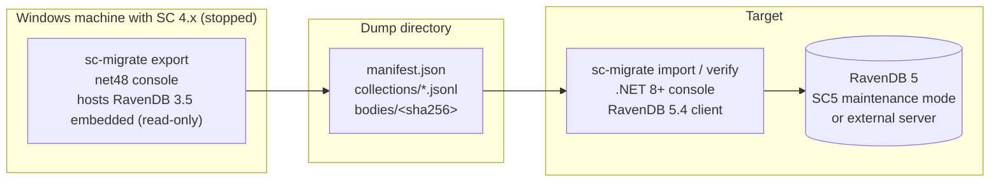

# ServiceControl 4.x → 5.x Error Instance Data Migration Utility — Design

**Date:** 2026-07-03
**Status:** Approved design, pending implementation plan
**Home:** [ramonsmits/ServiceControl.Migrate4to5](https://github.com/ramonsmits/ServiceControl.Migrate4to5) — standalone community tool, candidate for later transfer to the Particular org as official tooling
**Source versions analyzed:** ServiceControl 4.33.5 (RavenDB 3.5.10-patch-35319, Esent) and 5.11.11 (RavenDB.Embedded 5.4.209)

## Problem

Upgrading a ServiceControl **error/primary** instance from version 4 to version 5 has no data migration path. RavenDB 3.5 (in-process, Esent) and RavenDB 5.4 (separate server process, Voron) are incompatible on disk, and the official procedure is to *drain* the instance — retry or archive every failed message, disable ingestion, then run a destructive "Force Upgrade" that discards the database ([docs: upgrades/4to5](https://docs.particular.net/servicecontrol/upgrades/4to5/)). Audit instances have a side-by-side retention story (remotes); monitoring is non-durable. The error instance is the only one where valuable, non-regenerable data (unresolved and archived failed messages, group comments, retry history) is lost.

This utility fills that gap: a standalone command-line tool that **exports** the operational core of a stopped 4.x error instance's RavenDB 3.5 database to an intermediate dump, and **imports** it into a RavenDB 5 database used by a 5.x error instance.

## Constraints and non-goals

- **Offline migration.** The 4.x instance is stopped (or the tool runs against the `_UpgradeBackup` directory the forced upgrade leaves behind — making the official destructive path recoverable after the fact). The target RavenDB 5 server is reachable: an SC5 instance started in **maintenance mode** (embedded server on the database maintenance port, default 33334) or an external RavenDB 5 server.
- **No zero-downtime mode.** The error queue buffers in the transport during the window; no messages are lost.
- **Monitoring and audit instances are out of scope.** Monitoring is non-durable; audit has the documented side-by-side approach.
- **In-flight retry state does not cross the migration.** Operators quiesce retries before the window.
- Candidate for official Particular tooling; engineering bar set accordingly (deterministic behavior, no silent drops, resumability, verification command).

## Architecture



Two executables with an intermediate dump, not a single-process pipe. Rationale:

- **Dependency isolation.** `RavenDB.Database 3.5.10-patch-35319` is .NET Framework-only and embeds its own Lucene/JSON forks; the RavenDB 5.4 client is modern .NET. They never meet in one process.
- **Testability.** The import half — where all transforms live — is testable from canned dump fixtures with no Windows/Esent dependency.
- **Resumability and supportability.** The dump is an inspectable artifact; a failed import reruns idempotently; a customer can ship a dump to support.

Rejected alternatives:

- *Single-process pipe (3.5 engine + 5.4 client in one net48 AppDomain):* dependency cocktail, all-or-nothing failure mode, both halves locked to Windows.
- *RavenDB's built-in legacy migrator + post-transform:* imports legacy bloat (`ProcessedMessages` et al.), and server-side patches cannot create attachments, so the body transform requires client-side rewriting anyway — most of this tool's work with less control plus a manual Studio step.

### Projects

| Project | Target | References | Responsibility |
|---|---|---|---|
| `Exporter` | `net48` (Windows-only by necessity) | `RavenDB.Database 3.5.10-patch-35319` (Particular feedz.io feed) | Open `EmbeddableDocumentStore` read-only on `DbPath` (the same access pattern SC4 maintenance mode uses); stream collections and bodies to the dump. Reads raw `RavenJObject`s — no SC4 model-class dependency. |
| `Importer` | `net8.0`+ | `RavenDB.Client 5.4.x` | `import` and `verify` verbs. All transforms. Connects by URL, optional client certificate, database `primary`. |
| `DumpFormat` | `netstandard2.0` | — | Manifest/record contracts and the dump format version constant, shared by both halves so they cannot disagree silently. |

Shipped as one zip under a common `sc-migrate` naming scheme.

### CLI

```
sc-migrate export --db-path <DbPath> --out <dumpdir> [--collections <list>]
sc-migrate import --url <ravendb5-url> --database primary --in <dumpdir> [--error-retention <TimeSpan>] [--cert <pfx>]
sc-migrate verify --in <dumpdir> --url <ravendb5-url> --database primary
```

Both halves are strictly read-only toward their source: export never writes to the Esent files; import never deletes or overwrites.

### Operator flow

1. Stop the SC4 error instance (retries quiesced beforehand).
2. `sc-migrate export` against `DbPath` (or later against the `_UpgradeBackup` copy).
3. Force-upgrade to SC5 / install SC5.
4. Start SC5 in maintenance mode.
5. `sc-migrate import`, then `sc-migrate verify` (exit code gates scripted cutovers).
6. Start SC5 normally.

## Data mapping

Scope decision: **operational core** — data that is valuable and not regenerable, plus cheap self-healing dashboard state. Export dumps raw source JSON; **all transforms happen at import**, so the dump is a faithful snapshot.

| Collection | Id scheme (unchanged) | Tier | Import transform |
|---|---|---|---|
| `FailedMessages` | `FailedMessages/{uniqueMessageId}` | Critical | Metadata rewrite, body re-attachment, `@expires`, status normalization (below) |
| `GroupComments` | `GroupComment/{groupId}` | Important | Metadata rewrite only |
| `RetryOperations/History` | fixed singleton | Important | Metadata rewrite only |
| `messageredirects` | fixed singleton | Important | Straight copy |
| `NotificationsSettings/All` | fixed singleton | Important | Straight copy |
| `CustomChecks` | `CustomChecks/{deterministic-guid}` | Nice-to-have | Metadata rewrite only (same deterministic id scheme in both versions) |
| `KnownEndpoints` | `KnownEndpoints/{deterministic-guid}` | Nice-to-have | Drop `HasTemporaryId` (removed in 5.x); rest copies straight |

Tier meanings (full prose in the shipped `COLLECTIONS.md`, see Deliverables):

- **Critical** — cannot be regenerated; the reason the tool exists.
- **Important** — human-entered or historical state (comments, retry history, redirects, notification config) that is silently lost otherwise; redirects in particular change retry routing behavior if dropped.
- **Nice-to-have** — self-healing: custom checks and known endpoints repopulate as endpoints report against the new instance; migrating them avoids a blank dashboard on day one.

### Transforms

**Metadata rewrite (every document):** stamp the 5.x `Raven-Clr-Type` (types moved to the `ServiceControl.Persistence` assembly) and explicit `@collection`, mirroring what 5.x ingestion writes. Enums are stored as integers in both versions, so document bodies copy verbatim.

**FailedMessage bodies** — replicates 5.x ingestion (`RavenRecoverabilityIngestionUnitOfWork`) exactly:

- Export resolves each processing attempt's body from wherever 4.x put it — `ProcessingAttempt.Body` (inline, small non-binary), `MessageMetadata["Body"]` (full-text variant), or legacy attachment `messagebodies/{attemptMessageId}` — and writes it to `bodies/{sha256}` (content-addressed; deduplicates identical bodies across attempts and messages).
- Import takes the **most recent attempt's** body → RavenDB 5 attachment named `body` with the original content type; sets `ContentLength`/`BodyUrl` metadata; strips inline `Body` fields; re-creates `MsgFullText` for small (&lt; 85,000 bytes) non-binary bodies so full-text search works.

**Retention (`@expires`):** import stamps Resolved/Archived messages with `@expires = LastModified + ErrorRetentionPeriod` (`--error-retention`, since retention lives in instance config, not the database). Export skips documents already past retention — RavenDB's expiration sweep would delete them immediately after import. Unresolved messages get no `@expires`, matching 5.x semantics.

**Status normalization:** `RetryIssued → Unresolved` at import. In-flight retry staging (`RetryBatches`, `FailedMessageRetries`) does not migrate, so a RetryIssued message whose confirmation never arrives on the new instance would be stuck in limbo; as Unresolved the operator simply retries it. Quiescing retries before the window keeps the affected count near zero.

### Skipped collections (each reported in tool output, documented in `COLLECTIONS.md`)

| Collection | Reason |
|---|---|
| `EventLogItems` | Regenerated log noise; short retention (default 14 days) |
| `RetryBatches`, `RetryBatches/NowForwarding`, `FailedMessageRetries` | Transient retry staging; does not cross the migration |
| `FailedMessageEdit` | Transient edit staging |
| `ArchiveOperations/*`, `UnarchiveOperations/*` (+ batches) | Transient operation progress |
| `FailedErrorImports`, `FailedAuditImports` | Poison-ingestion queue tied to the old instance |
| `ProcessedMessages`, `SagaSnapshots` | Legacy pre-split audit data; audit is out of scope (side-by-side path exists) |
| `Subscriptions/All` (and legacy `Subscriptions`) | Internal messaging infrastructure; rebuilt by the new instance |
| `ReclassifyErrorSettings` | One-shot migration flag for 4.x itself |

## Dump format

```
dump/
  manifest.json                      format version, tool version, source DbPath,
                                     export UTC time, per-collection document counts,
                                     body count/bytes, checksums, completion marker
  collections/<CollectionName>.jsonl one raw RavenJObject + its metadata per line
  bodies/<sha256>                    body payloads, content-addressed
```

The manifest is written **last**: a dump without a complete manifest is invalid by construction, so a crashed export cannot be half-imported.

## Error handling and idempotency

- **Export** streams each collection with RavenDB 3.5's unbounded streaming API (no paging drift; the database is static).
- **Import** validates format version and manifest before touching the server, then bulk-inserts in fixed-size batches. Documents already present in the target are **skipped, never overwritten** — a fresh SC5 database only contains what earlier tool runs put there, so `import` is safely re-runnable after any crash or network drop.
- A body referenced by a document but missing from `bodies/` is a counted warning, not fatal — the document imports without an attachment (same user-visible behavior as 4.x messages whose body was never stored).
- **Verify** compares per-collection counts between manifest and target, spot-checks random documents field-by-field, and confirms attachment presence and size for random bodies (default 100 of each, `--samples <n>` to override). Exit code 0/1.
- Every run prints a summary table: exported / imported / skipped / warned per collection. **No silent drops.**

## Testing

1. **Unit (DumpFormat + import transforms):** canned JSONL fixtures of real-shaped 4.x documents — embedded-body, legacy-attachment-body, `MsgFullText` case, every `FailedMessageStatus` value, `RetryIssued` normalization, missing-body warning. No RavenDB required.
2. **Import integration:** `RavenDB.Embedded 5.4` test server (same harness style as ServiceControl's persistence tests). Import a fixture dump; assert documents, attachments, `@expires`; query through real 5.x indexes (`FailedMessageViewIndex`, `FailureGroupsViewIndex`) to prove ServicePulse-visible behavior.
3. **Export integration:** `net48` test project against a checked-in miniature RavenDB 3.5 database.
4. **End-to-end acceptance (release gate, Windows, scripted):** seed a real SC 4.33.5 instance with failures → export → import into a real SC 5.11 instance → diff both instances' HTTP APIs (`/errors`, `/messages/{id}/body`, `/recoverability/groups`).

## Deliverables

- `sc-migrate` tool (three projects above) with `export` / `import` / `verify` verbs.
- **`COLLECTIONS.md`** — data dictionary of every 4.x primary-instance collection: what feature it backs, how documents relate (Mermaid entity/relationship diagram: FailedMessage ↔ FailureGroups ↔ GroupComments; FailedMessage ↔ retry staging; KnownEndpoints ↔ CustomChecks), migrate/skip decision, and criticality tier.
- Operator runbook (`README.md`): the flow above, disk-space guidance (dump ≈ source data size), and the `_UpgradeBackup` recovery scenario.

## Open questions deferred to implementation planning

- Exact `Raven-Clr-Type` strings per collection (read from a live 5.x database during implementation rather than hardcoding blind).
- Whether `RetryOperations/History` schema drifted between 4.33.5 and 5.11.11 (field-level diff during implementation).
- Distribution channel if adopted officially (GitHub release zip vs. `dotnet tool` for the importer half).
